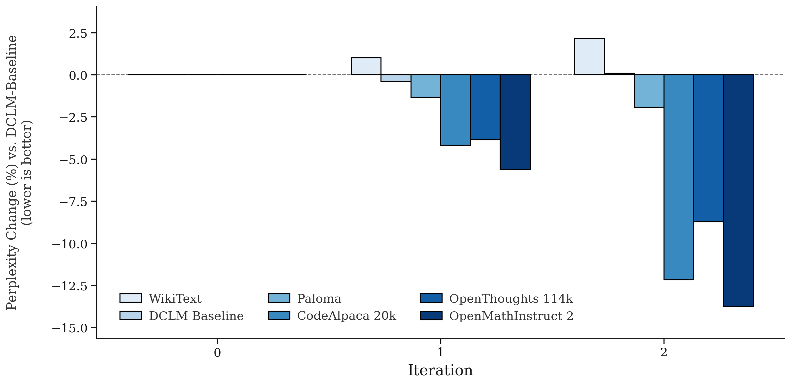
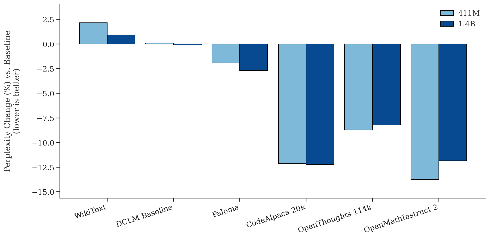

> TL;DR: We learn sampling weights over arbitrary data clusters using efficient influence approximations. We introduce m‑TrackStar to stably approximate influence and a meta‑optimizer (TerRIFIC) to iteratively update cluster weights based on cluster–target influence approximations. Utilizing data weights learned with TerRIFIC results in significant performance improvements over a (very) strong baseline. Our method is simple, scalable, and agnostic to how clusters are defined.

<em>Figure 1: TerRIFIC iteratively improves data weights resulting in drastically lower perplexity across various held out datasets</em>

Which data you choose to learn can often matter as much as model size or total tokens. Yet curating mixtures typically relies on ad‑hoc heuristics, expensive grid searches, or per‑example selection that does not scale. We introduce TerRIFIC (Topic Reweighting with Influence Functions In Clusters): a simple, scalable approach that meta‑learns how to sample from arbitrary groups of data using efficient influence approximations.

Our contributions are:

1. A minimal, necessary modification to efficient influence approximation, which we call $m‑TrackStar$.
2. A robust, scalable meta‑optimizer that learns per‑cluster sampling weights directly from influence‑on‑target signals (TerRIFIC).

Our results demonstrate meta‑learning can discover significant performance improvements over an already strong baseline.

## The Goal

We would ideally like to frame dataset selection as the following optimization problem:

$$
\max_{S \subseteq D} U(\theta_S^*) \quad \text{s.t.} \quad |S| \leq k \tag{1}
$$

where $S$ is our selected subset, $D$ is the full dataset, $\theta_S^*$ represents a model trained on subset $S$ with parameters $\theta$, $U(\cdot)$ is some utility function, and $k$ is our target dataset size due to compute constraints. We also stated that, in practice, **most** algorithms use

$$\max_{S \subseteq D}\sum_{x \in S} U(x) \quad \text{s.t.} \quad |S| \leq k \tag{2}$$

instead as computing $\theta_S^*$ is prohibitively expensive.

### Three Objectives

Practically speaking, a useful method should accomplish the following three things:

1. Develop more accurate ways to estimate the per-example utility $U(x)$ appearing in Eq. (1)
2. Bridge the gap between Eq. 1 and Eq. 2
3. Efficiently scale from small to large models + datasets

## Measuring Data Influence 

Before we can work on groups of examples, we must first determine how to measure if a sample helps (harms) learning for the capability(ies) we are interested in. We will do this using influence functions (Koh et al., 2017), which are defined in the following way:

$$I(z, z_{test}) = -\nabla_{\theta} L(z_{test}, \theta^*)^T H_{\theta^*}^{-1} \nabla_{\theta} L(z, \theta^*) \tag{3}$$

where $\theta^*$ represents the optimal model parameters, $H_{\theta^*}$ is the Hessian matrix at $\theta^*$, $z$ is a training example, and $z_{test}$ is a target example. With an asymptotically small step size, we are able to measure how much training on $z$ will reduce loss (i.e. learn) $z_{test}$.

### Addressing Inefficiencies

Due to astronomical storage and compute costs, explicit influence function computations are inefficient and impractical. Instead there are various methods that aim to approximate influence using block diagonal approximations of the Hessian (Martens et al., 2015; George et al., 2018), random projections (Park et al., 2023), and combinations of the two (Choe et al., 2024; Gupta et al., 2024). 

Due to its demonstrated utility on multi-billion parameter scale transformers, we use TrackStar as our starting point (Gupta et al., 2024), which the authors define as:

$$
G_{\theta}(z)=R^{-1/2}\,P_{d}\,\nabla_{\theta} L(z,\theta)\,V^{-1/2} \tag{4}
$$

where $z$ is the training example of interest, $P_{d}$ is a random projection operator, $R$ is the empirical Fisher matrix of the projected gradients, $\theta$ denotes the model parameters, and $V$ is the optimizer's second-moment estimate at $\theta$. It is worth noting that $P_{d}$ uses 2-sided projections defined as:

$$
P_{d_0}\, W\, P_{d_1}^{\top} \;\in\; \mathbb{R}^{\sqrt{d} \times \sqrt{d}} \tag{5}
$$

where $W\!\in\!\mathbb{R}^{n\times m}$ is a gradient matrix, and we define $P_{d_0},P_{d_1}\!\sim\!\mathcal N(0,1/\sqrt d)$ with $P_{d_0}\!\in\!\mathbb{R}^{\sqrt d \times m}$, $P_{d_1}\!\in\!\mathbb{R}^{n \times \sqrt d}$. To further decrease the representation size, layers are concatenated into B blocks. To accommodate characteristic differences between attention and MLP layers, these are concatenated separately.

Under a local quadratic approximation and with $R$ estimating the projected Fisher, the alignment $\langle G_{\theta}(z),\, G_{\theta}(z_{test}) \rangle$ is a stable approximation for $\nabla_{\theta} L(z_{test}, \theta^*)^{\top} H_{\theta^*}^{-1} \nabla_{\theta} L(z, \theta^*)$, enabling Eq. (3)-style influence ranking without materializing $H_{\theta^*}^{-1}$.

### $m-TrackStar$

We propose 2 changes to their method. First, we remove the second moment estimate, $V$, for simplicity, as empirical results have shown that it is not critical for efficacy (Gupta et al., 2024). Second, we replace L2 normalization with gradient clipping. This allows us to mitigate the effect of erroneous data, while not inflating the measured utility of low gradient norm examples. It is also more principled; influence functions are local approximations which lose accuracy when step sizes are too large, not too small. We implement this prior to computing $R$ so the approximate curvature of the loss landscape is computed w.r.t. "reasonable" data, not erroneous examples which can heavily skew the covariance matrix. We call the new primitive modified-TrackStar, or $m-TrackStar$, and define it below:

$$
mG_{\theta}(z)=R^{-1/2}\,P_{d}\,\mathrm{clip}_{t}\!\bigl(\nabla_{\theta} L(z,\theta)\bigr) \tag{6}
$$

where $\operatorname{clip}_{t}(g)$ is standard L2-norm gradient clipping that rescales a gradient $g$ so its Euclidean norm never exceeds the maximum threshold $t$.

## Moving Beyond Individual Examples

With our choice efficent method for approximating influence, we need to consider the dataset as a whole, not just individual examples. One approach attempted to address the sub-goal two by learning a relationship weight used to down-weight similar examples during selection (Yu et al., 2025). Later work has tried to address sub-goal three by computing the influence of a subset of examples and then training a classifier to predict the rest (Yu et al., 2024).

We will attempt to address each differently.

### A Reweighting Problem Over Arbitrary Groupings

To ensure our method is scalable, instead of considering individual examples, we will consider the influence of groups of examples. We will attempt to answer the following question:

*Can we learn how to sample from $C$ clusters s.t. we can optimally learn to perform some downstream task?*

The result is a meta-optimization problem (Engstrom et al., 2025) over $C$ probabilities. We can trivially extend our primitive from examples to groups of examples by averaging the influence computed by $m-TrackStar$ across members of a group. We then use the relative utility of each group to adjust the sampling probabilities.

>It is worth noting that this framing is a superset of the optimization problem over individual examples. When all cluster sizes are one, we collapse to the previous definition.

### Gradient Descent On Group Weights

Armed with an understanding of how to optimally update group weights at a given parameterization, we can perform metagradient descent (Engstrom et al., 2025) to learn an optimal solution. Given some arbitrary grouping of candidate data, we now introduce our meta-optimizer, which we call Topic Reweighting with Influence Functions In Clusters (TerRIFIC):

> Algorithm 1: TerRIFIC Meta-Optimizer
> - Inputs: model state $\theta^{(t)}$, target set $\mathcal{V}$, clusters $C=\{c_1,\dots,c_{|C|}\}$, logits $\text{logit}^{(t)}$, learning rate $\eta$, $\text{max}_{\text{step}}$.
> - Procedure:
>   1. $\displaystyle \bar{v} \leftarrow \tfrac{1}{|\mathcal{V}|}\sum_{z\in \mathcal{V}} mG_{\theta^{(t)}}(z)$
>   2. $\displaystyle \bar{I}_j \leftarrow \Big\langle \tfrac{1}{|c_j|}\sum_{z\in c_j} mG_{\theta^{(t)}}(z),\, \bar{v}\Big\rangle$;
>   3. $\text{logit}^{(t+1)}_j \leftarrow \text{logit}^{(t)}_j + \eta\, f(\bar{I}_j)$ (see Eq. (7))
>   4. return $\text{logits}^{(t+1)}$

To ensure a smooth optimization landscape, we employ standard clipping, centering and rescaling with $f$, which we define as:

$$f(\bar I_j) = \mathrm{clip}\!\left(\frac{\bar I_j - \mu}{\sigma},\, \text{max}_{\text{step}}\right) \tag{7}$$

where $W=\{\,j:\; q_{0.001}(\{\bar I_{\ell}\}) < \bar I_j < q_{0.999}(\{\bar I_{\ell}\})\,\}$ over $\ell\in\{1,\dots,|C|\}$, and $\mu,\sigma$ are the mean and standard deviation over $\{\bar I_k: k\in W\}$.

When applied iteratively, via Algorithm 2, our optimizer refines the cluster logits toward an optimal sampling distribution.

> Algorithm 2: Meta‑Training Procedure (outer loop)
> - Inputs: learning algorithm $A$, clusters of training examples $C$, initial sampling logits $\text{logits}^{(0)}$, target set $\mathcal{V}$, horizon $T$, learning rate $\eta$, maximum step size $\text{max}_{\text{step}}$
> - Procedure
>   1. For $t = 0,1,\dots,T-1$:
>      - Sample $S_t \sim \mathrm{mix}(\mathrm{softmax}(\mathbf{logits}^{(t)}))$ and train a model $\theta^{(t)} = A(S_t)$.
>      - Call Algorithm 1 with $(\theta^{(t)},\mathcal{V},C,\text{logit}^{(t)}, \eta, max_{step})$ to obtain $\text{logits}^{(t+1)}$.
>   2. return $\text{logits}^{(T)}$

## Experimental Setup

We experiment using the training hyperparameters from Datacomp for Language Models (DCLM) (Li et al., 2024). We select a ~37B token subset of DCLM-Baseline as our starting corpus. From this, we randomly select ~12B tokens to learn cluster weights.

> DCLM-Baseline is already one of the most heavily curated open datasets. It outperforms Fineweb-Edu with 50% fewer tokens and C4 with 80% fewer tokens.

We embed each document, truncated to 1024 tokens, using Qwen3-Embedding-0.6B (Zhang et al., 2025) and use FAISS k-means to cluster the documents in $10,000$ clusters, following precedent set by SemDeDup (Abbas et al., 2023). We choose OpenHermes 2.5 (Teknium, 2024) as our target set and truncate each example to 2048 tokens, the size of our context window. During training, we employ a 2-way jittered shuffle to ensure maximal cluster balance + optimal spacing between repeated examples; details are in the appendix. At each iteration we train a 411M-parameter model for the Chinchilla-optimal number of tokens, but exit early from the run after 80% of tokens have been seen.

> (Engstrom et al., 2025) determine that a checkpoint late in training, but before the learning rate has fully decayed, is optimal for *meta-smoothness* - a critical condition for meta-optimization.

To improve efficiency, only a small subset of examples is used to effectively approximate the mean influence of each cluster. Additionally, we transfer learned cluster weights to larger datasets and models.

## Quantitative Results

We evaluate performance using perplexity on Paloma (Magnusson et al., 2023), WikiText (Merity et al., 2016), OpenThoughts-114k (Guha et al., 2025), CodeAlpaca-20k (Chaudhary, 2023), OpenMathInstruct 2 (Toshniwal et al., 2024) and a held-out shard of the DCLM-Baseline corpus (Li et al., 2024).

<table style="border-collapse:collapse; width:100%">
  <thead>
    <tr>
      <th rowspan="2" style="text-align:left">Task</th>
      <th colspan="3" style="text-align:center">411M Model - 8.2B Tokens</th>
      <th colspan="2" style="text-align:center; border-left:2px solid #ccc">1.4B Model - 28B Tokens</th>
    </tr>
    <tr>
      <th style="text-align:right">Baseline</th>
      <th style="text-align:right">Iteration 1</th>
      <th style="text-align:right">Iteration 2</th>
      <th style="text-align:right; border-left:2px solid #ccc">Baseline</th>
      <th style="text-align:right">Iteration 2</th>
    </tr>
  </thead>
  <tbody>
    <tr><td>Wikitext</td><td style="text-align:right"><strong>3.10</strong></td><td style="text-align:right">3.11</td><td style="text-align:right">3.12</td><td style="text-align:right; border-left:2px solid #ccc"><strong>2.65</strong></td><td style="text-align:right">2.66</td></tr>
    <tr><td>DCLM-Baseline</td><td style="text-align:right"><strong>3.02</strong></td><td style="text-align:right"><strong>3.02</strong></td><td style="text-align:right"><strong>3.02</strong></td><td style="text-align:right; border-left:2px solid #ccc"><strong>2.67</strong></td><td style="text-align:right"><strong>2.67</strong></td></tr>
    <tr><td>Paloma</td><td style="text-align:right">2.94</td><td style="text-align:right">2.92</td><td style="text-align:right"><strong>2.91</strong></td><td style="text-align:right; border-left:2px solid #ccc">2.62</td><td style="text-align:right"><strong>2.59</strong></td></tr>
    <tr><td>OpenThoughts-114k</td><td style="text-align:right">2.03</td><td style="text-align:right">1.99</td><td style="text-align:right"><strong>1.94</strong></td><td style="text-align:right; border-left:2px solid #ccc">1.70</td><td style="text-align:right"><strong>1.61</strong></td></tr>
    <tr><td>CodeAlpaca-20k</td><td style="text-align:right">2.17</td><td style="text-align:right">2.13</td><td style="text-align:right"><strong>2.04</strong></td><td style="text-align:right; border-left:2px solid #ccc">1.77</td><td style="text-align:right"><strong>1.64</strong></td></tr>
    <tr><td>OpenMathInstruct 2</td><td style="text-align:right">1.47</td><td style="text-align:right">1.41</td><td style="text-align:right"><strong>1.32</strong></td><td style="text-align:right; border-left:2px solid #ccc">1.15</td><td style="text-align:right"><strong>1.02</strong></td></tr>
  </tbody>
</table>

<em>Table 1: NLL across meta‑iterations on our target tasks. Best results are in <strong>bold</strong>.</em>

As show in Figure 1 and Table 1, TerRIFIC is able to iteratively refine thousands of cluster weights resulting in significant downstream improvements. Due to the high concentration of math and code data in OpenHermes 2.5, the optimization process most drastically improves performance on OpenMathInstruct 2, OpenThoughts-114k, and CodeAlpaca-20k. It also boosts general language modeling abilities as exhibited by the improvement on Paloma and lack of change on held out DCLM-Baseline, with only small regression in recall (WikiText).

It is also worth acknowledging that only 2 meta-iterations were required to learn data weights that exhibited non-trivial performance improvements. A grid search over 10,000 cluster weights would have taken many orders of magnitude more compute to yield performance gains.

### Scaling Up

<em>Figure 2: Cluster weights transfer seamlessly to runs requiring >11x FLOPs. Performance comparisons are w.r.t DCLM-Baseline.</em>

In order for our method to be viable, it must translate to larger scale results with minimal regression. In order to verify this, we reintroduced the 25B tokens that were held out from the cluster weight learning process. We trained 1.4B-parameter language models for 28B tokens, a ~14.5x FLOP increase over models used to learn data weights and ~11.6x FLOP increase over our fully trained 411M model.

Results in Figure 2 show nearly all performance improvements transfer. In fact, general language modeling and recall marginally improve, coding is unchanged and only minor regressions are seen on math and reasoning. Due to compute constraints, larger runs were not possible, but the near absence of degredation leads to confidence that performance will continue to transfer.

### Downstream Accuracy

<table style="border-collapse:collapse; width:100%">
  <thead>
    <tr>
      <th rowspan="2" style="text-align:left">Task</th>
      <th colspan="3" style="text-align:center">411M Model - 8.2B Tokens</th>
      <th colspan="2" style="text-align:center; border-left:2px solid #ccc">1.4B Model - 28B Tokens</th>
    </tr>
    <tr>
      <th style="text-align:right">Baseline</th>
      <th style="text-align:right">Iteration 1</th>
      <th style="text-align:right">Iteration 2</th>
      <th style="text-align:right; border-left:2px solid #ccc">Baseline</th>
      <th style="text-align:right">Iteration 2</th>
    </tr>
  </thead>
  <tbody>
    <tr><td>Jeopardy</td><td style="text-align:right"><strong>0.036</strong></td><td style="text-align:right">0.032</td><td style="text-align:right">0.023</td><td style="text-align:right; border-left:2px solid #ccc">0.258</td><td style="text-align:right"><strong>0.262</strong></td></tr>
    <tr><td>BB-QA-Wikidata</td><td style="text-align:right"><strong>0.433</strong></td><td style="text-align:right">0.408</td><td style="text-align:right">0.408</td><td style="text-align:right; border-left:2px solid #ccc">0.578</td><td style="text-align:right"><strong>0.598</strong></td></tr>
    <tr><td>ARC-Easy</td><td style="text-align:right">0.357</td><td style="text-align:right"><strong>0.371</strong></td><td style="text-align:right">0.356</td><td style="text-align:right; border-left:2px solid #ccc">0.529</td><td style="text-align:right"><strong>0.532</strong></td></tr>
    <tr><td>ARC-Challenge</td><td style="text-align:right">0.020</td><td style="text-align:right">0.034</td><td style="text-align:right"><strong>0.039</strong></td><td style="text-align:right; border-left:2px solid #ccc">0.129</td><td style="text-align:right"><strong>0.158</strong></td></tr>
    <tr><td>HellaSwag (0-shot)</td><td style="text-align:right"><strong>0.170</strong></td><td style="text-align:right">0.162</td><td style="text-align:right">0.168</td><td style="text-align:right; border-left:2px solid #ccc"><strong>0.442</strong></td><td style="text-align:right">0.440</td></tr>
    <tr><td>LAMBADA</td><td style="text-align:right">0.421</td><td style="text-align:right"><strong>0.441</strong></td><td style="text-align:right">0.412</td><td style="text-align:right; border-left:2px solid #ccc">0.592</td><td style="text-align:right"><strong>0.597</strong></td></tr>
    <tr><td>HellaSwag (10-shot)</td><td style="text-align:right">0.169</td><td style="text-align:right">0.166</td><td style="text-align:right"><strong>0.170</strong></td><td style="text-align:right; border-left:2px solid #ccc">0.447</td><td style="text-align:right"><strong>0.456</strong></td></tr>
    <tr><td>Winograd</td><td style="text-align:right">0.297</td><td style="text-align:right"><strong>0.311</strong></td><td style="text-align:right">0.253</td><td style="text-align:right; border-left:2px solid #ccc">0.516</td><td style="text-align:right"><strong>0.524</strong></td></tr>
    <tr><td>Winogrande</td><td style="text-align:right"><strong>0.034</strong></td><td style="text-align:right">0.020</td><td style="text-align:right">−0.006</td><td style="text-align:right; border-left:2px solid #ccc"><strong>0.162</strong></td><td style="text-align:right">0.124</td></tr>
    <tr><td>BB-Language-ID</td><td style="text-align:right"><strong>0.177</strong></td><td style="text-align:right">0.175</td><td style="text-align:right"><strong>0.177</strong></td><td style="text-align:right; border-left:2px solid #ccc"><strong>0.182</strong></td><td style="text-align:right"><strong>0.182</strong></td></tr>
    <tr><td>COPA</td><td style="text-align:right">0.140</td><td style="text-align:right"><strong>0.240</strong></td><td style="text-align:right"><strong>0.240</strong></td><td style="text-align:right; border-left:2px solid #ccc"><strong>0.460</strong></td><td style="text-align:right">0.400</td></tr>
    <tr><td>PIQA</td><td style="text-align:right">0.330</td><td style="text-align:right"><strong>0.342</strong></td><td style="text-align:right">0.341</td><td style="text-align:right; border-left:2px solid #ccc"><strong>0.478</strong></td><td style="text-align:right">0.476</td></tr>
    <tr><td>OpenBook-QA</td><td style="text-align:right">0.091</td><td style="text-align:right"><strong>0.109</strong></td><td style="text-align:right">0.088</td><td style="text-align:right; border-left:2px solid #ccc"><strong>0.187</strong></td><td style="text-align:right">0.165</td></tr>
    <tr><td>BB-Dyck-Languages</td><td style="text-align:right">0.177</td><td style="text-align:right">0.192</td><td style="text-align:right"><strong>0.218</strong></td><td style="text-align:right; border-left:2px solid #ccc">0.193</td><td style="text-align:right"><strong>0.271</strong></td></tr>
    <tr><td>BB-Operators</td><td style="text-align:right"><strong>0.152</strong></td><td style="text-align:right">0.119</td><td style="text-align:right">0.148</td><td style="text-align:right; border-left:2px solid #ccc">0.167</td><td style="text-align:right"><strong>0.195</strong></td></tr>
    <tr><td>BB-Repeat-Copy-Logic</td><td style="text-align:right">0.000</td><td style="text-align:right">0.000</td><td style="text-align:right"><strong>0.031</strong></td><td style="text-align:right; border-left:2px solid #ccc">0.031</td><td style="text-align:right"><strong>0.063</strong></td></tr>
    <tr><td>SQuAD</td><td style="text-align:right">0.126</td><td style="text-align:right">0.121</td><td style="text-align:right"><strong>0.142</strong></td><td style="text-align:right; border-left:2px solid #ccc"><strong>0.380</strong></td><td style="text-align:right"><strong>0.380</strong></td></tr>
    <tr><td>CoQA</td><td style="text-align:right">0.150</td><td style="text-align:right">0.156</td><td style="text-align:right"><strong>0.163</strong></td><td style="text-align:right; border-left:2px solid #ccc"><strong>0.301</strong></td><td style="text-align:right"><strong>0.301</strong></td></tr>
    <tr style="background-color:#d6ecff;"><td><strong>Mean</strong></td><td style="text-align:right">0.185</td><td style="text-align:right"><strong>0.192</strong></td><td style="text-align:right">0.190</td><td style="text-align:right; border-left:2px solid #ccc">0.338</td><td style="text-align:right"><strong>0.343</strong></td></tr>
  </tbody>
</table>

<em>Table 2: Downstream performance (centered accuracy) on DCLM-CORE-CLEAN. Best results in <strong>bold</strong>.</em>

We also evaluate the models on 18 out of 22 tasks in DCLM-CORE, which we call DCLM-CORE-CLEAN. We choose to exclude AGI_EVAL_LSAT_AR, Commonsense_QA, BoolQ, and BB-CS-Algorithms due to the results being incoherent across scales. Frequently, the 411M models outperform the 1.4B models.

As shown in Table 2, our method frequently outperforms the baseline mix, both on individual evals and in aggregate. The most significant gains can be found on symbolic problem solving evals which is expected due to the composition of OpenHermes 2.5. 

We use these downstream evaluations, largely, as a secondary performance measurement. At the scales we evaluate, performance varies greatly across runs. 

> The weakness of accuracy based evaluation at this scale (and up a few OOMs further actually !!!) is made obvious by results on Fineweb-Edu and RefinedWeb (Li et al., 2024).
> * @411M, 1x Chinchilla - Fineweb +2.9%
> * @1.4B, 1x Chinchilla - Fineweb -0.9%
> * @1.4B, 5x Chinchilla - Fineweb +2.4%
> * @7B, 1x Chinchilla - Fineweb -1.1%
>
> ... not ideal

<table style="border-collapse:collapse; width:100%">
  <thead>
    <tr>
      <th rowspan="2" style="text-align:left">Task</th>
      <th colspan="3" style="text-align:center">411M Model - 8.2B Tokens</th>
      <th colspan="2" style="text-align:center; border-left:2px solid #ccc">1.4B Model - 28B Tokens</th>
    </tr>
    <tr>
      <th style="text-align:right">Baseline</th>
      <th style="text-align:right">Iteration 1</th>
      <th style="text-align:right">Iteration 2</th>
      <th style="text-align:right; border-left:2px solid #ccc">Baseline</th>
      <th style="text-align:right">Iteration 2</th>
    </tr>
  </thead>
  <tbody>
    <tr><td>Jeopardy</td><td style="text-align:right"><strong>2.747</strong></td><td style="text-align:right">2.767</td><td style="text-align:right">2.762</td><td style="text-align:right; border-left:2px solid #ccc"><strong>1.574</strong></td><td style="text-align:right">1.592</td></tr>
    <tr><td>BB-QA-Wikidata</td><td style="text-align:right"><strong>4.930</strong></td><td style="text-align:right">5.118</td><td style="text-align:right">5.239</td><td style="text-align:right; border-left:2px solid #ccc">3.821</td><td style="text-align:right"><strong>3.665</strong></td></tr>
    <tr><td>ARC-Easy</td><td style="text-align:right">2.813</td><td style="text-align:right"><strong>2.804</strong></td><td style="text-align:right">2.811</td><td style="text-align:right; border-left:2px solid #ccc">2.160</td><td style="text-align:right"><strong>2.142</strong></td></tr>
    <tr><td>ARC-Challenge</td><td style="text-align:right">2.937</td><td style="text-align:right"><strong>2.898</strong></td><td style="text-align:right">2.916</td><td style="text-align:right; border-left:2px solid #ccc">2.379</td><td style="text-align:right"><strong>2.361</strong></td></tr>
    <tr><td>HellaSwag</td><td style="text-align:right">2.729</td><td style="text-align:right"><strong>2.716</strong></td><td style="text-align:right">2.720</td><td style="text-align:right; border-left:2px solid #ccc">2.375</td><td style="text-align:right"><strong>2.374</strong></td></tr>
    <tr><td>LAMBADA</td><td style="text-align:right">1.937</td><td style="text-align:right"><strong>1.913</strong></td><td style="text-align:right">1.953</td><td style="text-align:right; border-left:2px solid #ccc"><strong>1.266</strong></td><td style="text-align:right">1.286</td></tr>
    <tr><td>Winograd</td><td style="text-align:right">2.805</td><td style="text-align:right"><strong>2.796</strong></td><td style="text-align:right">2.811</td><td style="text-align:right; border-left:2px solid #ccc">2.475</td><td style="text-align:right"><strong>2.459</strong></td></tr>
    <tr><td>Winogrande</td><td style="text-align:right"><strong>3.288</strong></td><td style="text-align:right">3.290</td><td style="text-align:right">3.291</td><td style="text-align:right; border-left:2px solid #ccc"><strong>3.064</strong></td><td style="text-align:right">3.076</td></tr>
    <tr><td>BB-Language-ID</td><td style="text-align:right">10.972</td><td style="text-align:right"><strong>8.868</strong></td><td style="text-align:right">10.336</td><td style="text-align:right; border-left:2px solid #ccc">9.276</td><td style="text-align:right"><strong>9.226</strong></td></tr>
    <tr><td>COPA</td><td style="text-align:right"><strong>2.854</strong></td><td style="text-align:right">2.864</td><td style="text-align:right">2.860</td><td style="text-align:right; border-left:2px solid #ccc">2.491</td><td style="text-align:right"><strong>2.440</strong></td></tr>
    <tr><td>PIQA</td><td style="text-align:right">2.947</td><td style="text-align:right">2.945</td><td style="text-align:right"><strong>2.934</strong></td><td style="text-align:right; border-left:2px solid #ccc"><strong>2.557</strong></td><td style="text-align:right">2.558</td></tr>
    <tr><td>OpenBook-QA</td><td style="text-align:right">4.540</td><td style="text-align:right"><strong>4.517</strong></td><td style="text-align:right">4.534</td><td style="text-align:right; border-left:2px solid #ccc">4.081</td><td style="text-align:right"><strong>4.047</strong></td></tr>
    <tr><td>BB-Dyck-Languages</td><td style="text-align:right">4.579</td><td style="text-align:right">4.893</td><td style="text-align:right"><strong>4.260</strong></td><td style="text-align:right; border-left:2px solid #ccc">4.321</td><td style="text-align:right"><strong>3.418</strong></td></tr>
    <tr><td>BB-Operators</td><td style="text-align:right"><strong>5.545</strong></td><td style="text-align:right">5.707</td><td style="text-align:right">5.947</td><td style="text-align:right; border-left:2px solid #ccc">4.995</td><td style="text-align:right"><strong>4.513</strong></td></tr>
    <tr><td>BB-Repeat-Copy-Logic</td><td style="text-align:right">1.870</td><td style="text-align:right"><strong>1.797</strong></td><td style="text-align:right">1.819</td><td style="text-align:right; border-left:2px solid #ccc">1.362</td><td style="text-align:right"><strong>1.194</strong></td></tr>
    <tr><td>SQuAD</td><td style="text-align:right">4.047</td><td style="text-align:right">3.738</td><td style="text-align:right"><strong>3.597</strong></td><td style="text-align:right; border-left:2px solid #ccc">3.277</td><td style="text-align:right"><strong>3.249</strong></td></tr>
    <tr><td>CoQA</td><td style="text-align:right">4.634</td><td style="text-align:right">4.452</td><td style="text-align:right"><strong>4.242</strong></td><td style="text-align:right; border-left:2px solid #ccc">3.791</td><td style="text-align:right"><strong>3.628</strong></td></tr>
    <tr style="background-color:#d6ecff;"><td><strong>Mean</strong></td><td style="text-align:right">3.893</td><td style="text-align:right"><strong>3.770</strong></td><td style="text-align:right">3.825</td><td style="text-align:right; border-left:2px solid #ccc">3.251</td><td style="text-align:right"><strong>3.131</strong></td></tr>
  </tbody>
</table>

<em>Table 3: Correct answer NLL on DCLM-CORE-CLEAN. Best results in <strong>bold</strong>.</em>

In an attempt to further mitigate these issues, we report downstream correct answer NLL in Table 3. While also an imperfect metric, the trend holds: TerRIFIC finds sizable performance improvements at both scales.

## Qualitative Results

We also qualitatively inspect the highest and lowest scoring clusters. Descriptions are shown in Table 4. 

High scoring data is largely intuitive - educational data with clear explanations, logic, and grounded answers. It also shows that data containing unit conversions, and other paired information, is important for learning problem solving primitives; however, it is worth noting this may be specific to the kinds of downstream tasks in OpenHermes 2.5. 

The lowest scoring examples also contain some clusters that are easily understood to be low quality: lists of dictionary pages and low context job postings, in addition to pop culture "slop". However, a surprising amount of low-level programming data is also deemed very low quality. We hypothesize this is due to the fact that the model is too weak to make use of this data, in addition to the fact that it is minimally present in OpenHermes 2.5.

Examples of high and low scoring data are show in the Appendix.

## Related Work

This is not the first attempt to use influence functions for cluster reweighting. Zhang et al. (2024) framed influence-based, cluster-level sampling as a multi-armed bandit problem. Instead of allowing an iterative algorithm to learn optimal weights, they sample according to influence computed on a single model state. In order to avoid diversity issues that come with simple $top-k$ selection methods, they enforce diversity through a tunable hyperparameter. By removing the need to tune this parameter and allowing selection to be driven, solely, by behaviors desired in the downstream model, we offer a simpler, more flexible approach.

There are also approaches that look at reweighting over clusters/domains such as (Liu et al., 2025) and (Diao et al., 2025). However, these approaches rely on grid search, which is costly and heavily limits the number of parameters (in our setting, cluster weights) that can be optimized.

Additional recent work using metagradient-based data filtering was explored by Calian et al. (2025). Their method uses meta-gradients to learn a scoring function, which is used for online minibatch selection. While offering an exciting direction, they evaluate on notably weaker starting corpuses and yield minimal compute savings when they reach C4. In contrast, our results demonstrate significant performance improvements using a starting corpus that is already orders of magnitude more compute efficient than C4.

Perhaps the most closely related work is that in (Engstrom et al., 2025). While similar, by transitioning from individual datapoints to groups of datapoints, our setup presents three advantages:

1. Weights can be transfered from small to large datasets.
2. Computational cost is dominated by model training, not optimizer steps.
3. We don't require a surrogate algorithm for smooth optimization; instead we directly optimize group weights with only standard clipping and rescaling.

## Next Steps

The setup we propose is far from optimized. No portion of $m-TrackStar$ was ablated. Neither was the meta-learning rate, the checkpoint selected for influence approximation, or the number of clusters.

### Better Utilizing Duplicate Data

It is worth emphasizing that duplicate examples are left augmentation-free. Recent work in (Prabhudesai et al., 2025) demonstrates significant performance improvements in multi-epoch training by randomly permuting samples. Not only should this improve performance given a set of pre-learned group weights, if added to the meta-learning process it should allow the learning algorithm to more aggressivly upsample high quality data as augmentation causes utility to decay more slowly with redundancy.

### Alternative Ways To Group Data

In addition to this, we don't explore other ways to group data. One of the greatest strengths of our method is it's ability to transition from hard cutoffs to smooth interpolations. Instead of strictly filtering based on classifier scores, like in the creation of DCLM, FineWeb, and many others (Li et al., 2024; Penedo et al., 2024), you can use these scores (or any other metric you curate) to divide examples, but let the meta-learning process determine final utilty.

### Alternative Downstream Targets

Since our method determines updates by solely analyzing gradient alignment, it can be applied out of the box to any kind of downstream training target. This means that there is no change required to change the target from vanilla next token prediction (pre-training, sft) to any flavor of RL (PPO, DPO, GRPO, etc) or any combination therein. 

*Concretely, TerRIFIC can make use of any post-training signal you can create... during pre-training.*

## Final Thoughts

TerRIFIC is a simple, scalable meta‑optimizer that learns sampling weights over any partition of your corpus, domains, topics, or micro‑clusters. It consistently improves downstream performance across various held out tasks.

In practice, it is incredibly simple:

1. cluster the dataset and initialize sampling in the way you currently deem optimal
2. curate your target set of desired capabilities + behaviors
3. iteratively train small models and update the sampling logits
4. utilize the learned mixture at scale

If you can divide a dataset, you can learn how to optimally sample from it. We hope this enables more principled, capability‑aligned curation at scale.

## Acknowledgements

I want to say a quick thank you to Vincent Wilmet and Rohan Ahluwalia for feedback on earlier versions of this project. Also, thank you to NFDG for providing the compute that made this possible. Finally, thank you to Wil Moushey and the rest of andromeda.ai - the team is the best out there.

## References

[1] Pang Wei Koh, Percy Liang. Understanding Black-box Predictions via influence functions. arXiv preprint arXiv:1703.04730 (2017).

[2] James Martens and Roger Grosse. Optimizing Neural Networks with Kronecker-Factored Approximate Curvature. arXiv preprint arXiv:1503.05671 (2015).

[3] Tijmen T. George, Thrandis Wei, David Ritchie, and George Rudin. Fast Approximate Natural Gradient Descent in a Kronecker-Factored Eigenbasis (EK-FAC). In Advances in Neural Information Processing Systems (NeurIPS), 2018.

[4] Sung Min Park, Kristian Georgiev, Andrew Ilyas, Guillaume Leclerc, Aleksander Madry. TRAK: Attributing Model Behavior at Scale. arXiv preprint arXiv:2303.14186 (2023).

[5] Sang Keun Choe, Hwijeen Ahn, Juhan Bae, Kewen Zhao, Minsoo Kang, Youngseog Chung, Adithya Pratapa, Willie Neiswanger, Emma Strubell, Teruko Mitamura, Jeff Schneider, Roger Grosse, Eric Xing. *What is Your Data Worth to GPT? LLM-Scale Data Valuation with Influence Functions*. arXiv preprint arXiv:2405.13954 (2024).

[6] Priyanshu Gupta, Yassir Fathullah, Xiang Ren. Scaling Influence Functions to Modern Deep Learning. arXiv preprint arXiv:2410.17413 (2024).

[7] Zichun Yu, Spandan Das, Chenyan Xiong. *MATES: Model-Aware Data Selection for Efficient Pretraining with Data Influence Models*. arXiv preprint arXiv:2406.06046 (2024).

[8] Zichun Yu, Fei Peng, Jie Lei, Arnold Overwijk, Wen-tau Yih, Chenyan Xiong. *Data-Efficient Pretraining with Group-Level Data Influence Modeling (Group-MATES)*. arXiv preprint arXiv:2502.14709 (2025).

[9] Logan Engstrom, Andrew Ilyas, Benjamin Chen, Axel Feldmann, William Moses, Aleksander Madry. *Optimizing ML Training with Metagradient Descent*. arXiv preprint arXiv:2503.13751 (2025).

[10] Jeffrey Li, Alex Fang, Georgios Smyrnis, Maor Ivgi, Matt Jordan, Samir Gadre, Hritik Bansal, Etash Guha, Sedrick Keh, Kushal Arora, Saurabh Garg, Rui Xin, Niklas Muennighoff, Reinhard Heckel, Jean Mercat, Mayee Chen, Suchin Gururangan, Mitchell Wortsman, Alon Albalak, Yonatan Bitton, Marianna Nezhurina, Amro Abbas, Cheng-Yu Hsieh, Dhruba Ghosh, Josh Gardner, Maciej Kilian, Hanlin Zhang, Rulin Shao, Sarah Pratt, Sunny Sanyal, Gabriel Ilharco, Giannis Daras, Kalyani Marathe, Aaron Gokaslan, Jieyu Zhang, Khyathi Chandu, Thao Nguyen, Igor Vasiljevic, Sham Kakade, Shuran Song, Sujay Sanghavi, Fartash Faghri, Sewoong Oh, Luke Zettlemoyer, Kyle Lo, Alaaeldin El-Nouby, Hadi Pouransari, Alexander Toshev, Stephanie Wang, Dirk Groeneveld, Luca Soldaini, Pang Wei Koh, Jenia Jitsev, Thomas Kollar, Alexandros G. Dimakis, Yair Carmon, Achal Dave, Ludwig Schmidt, Vaishaal Shankar. DataComp-LM: In Search of the Next Generation of Training Sets for Language Models. arXiv preprint arXiv:2406.11794 (2024).

[11] Yanzhao Zhang, Mingxin Li, Dingkun Long, Xin Zhang, Huan Lin, Baosong Yang, Pengjun Xie, An Yang, Dayiheng Liu, Junyang Lin, Fei Huang, Jingren Zhou. *Qwen3 Embedding: Advancing Text Embedding and Reranking Through Foundation Models*. arXiv preprint arXiv:2506.05176 (2025).

[12] Amro Abbas, Kushal Tirumala, Dániel Simig, Surya Ganguli, Ari S. Morcos. *SemDeDup: Data-efficient learning at web-scale through semantic deduplication*. arXiv preprint arXiv:2303.09540 (2023).

[13] Teknium. *OpenHermes 2.5: An open dataset of synthetic data for generalist LLM assistants*. arXiv preprint arXiv:2404.00495 (2024).

[14] Ian Magnusson, Akshita Bhagia. Paloma: A Benchmark for Evaluating Language Model Fit. arXiv preprint arXiv:2312.10523 (2023).

[15] Chi Zhang, Huaping Zhong Harnessing Diversity for Important Data Selection in Pretraining Large Language Models. arXiv preprint arXiv:2409.16986 (2024).

[16] Fengze Liu, Weidong Zhou, Binbin Liu, Zhimiao Yu, Yifan Zhang, Haobin Lin, Yifeng Yu, Bingni Zhang, Xiaohuan Zhou, Taifeng Wang, Yong Cao. QuaDMix: Quality-Diversity Balanced Data Selection for Efficient LLM Pretraining. arXiv preprint arXiv:2504.16511 (2025).

[17] Shizhe Diao, Yu Yang, Yonggan Fu, Xin Dong, Dan Su, Markus Kliegl, Zijia Chen, Peter Belcak, Yoshi Suhara, Hongxu Yin, Mostofa Patwary, Yingyan Lin, Jan Kautz, Pavlo Molchanov. CLIMB: CLustering-based Iterative Data Mixture Bootstrapping for Language Model Pre-training. arXiv preprint arXiv:2504.13161 (2025).

[18] Dan Andrei Calian, Gregory Farquhar, Iurii Kemaev, Luisa M. Zintgraf, Matteo Hessel, Jeremy Shar, Junhyuk Oh, András György, Tom Schaul, Jeffrey Dean, Hado van Hasselt, David Silver. DataRater: Meta-Learned Dataset Curation. arXiv preprint arXiv:2505.17895 (2025).

[19] Mihir Prabhudesai, Mengning Wu. Diffusion Beats Autoregressive in Data-Constrained Settings. arXiv preprint arXiv:2507.15857 (2025).

[20] Stephen Merity, Caiming Xiong, James Bradbury, Richard Socher. Pointer Sentinel Mixture Models. arXiv preprint arXiv:1609.07843 (2016).

[21] Guilherme Penedo, Hynek Kydlíček, Loubna Ben Allal, Anton Lozhkov, Margaret Mitchell, Colin Raffel, Leandro von Werra, Thomas Wolf. The FineWeb Datasets: Decanting the Web for the Finest Text Data at Scale. arXiv preprint arXiv:2406.17557 (2024).

[22] Etash Guha, Ryan Marten, Sedrick Keh, et al. OpenThoughts: Data Recipes for Reasoning Models. arXiv preprint arXiv:2506.04178 (2025).

[23] Sahil Chaudhary. Code Alpaca: An Instruction-following LLaMA Model for Code Generation. GitHub repository (2023).

[24] Shubham Toshniwal, Wei Du, Ivan Moshkov, Branislav Kisacanin, Alexan Ayrapetyan, Igor Gitman. OpenMathInstruct-2: Accelerating AI for Math with Massive Open-Source Instruction Data. arXiv preprint arXiv:2410.01560 (2024).

## Appendix

### 2‑Way Jittered Shuffling

*Purpose*: Evenly space (i) repeated samples *within* each semantic cluster and (ii) successive samples *across* clusters according to sampling probabilities.

#### Within Cluster spacing

For every cluster $c_i$ draw one random permutation $\rho_i$ of its members. Emit the elements of $c_i$ by cycling through $\rho_i$ until exactly $n_i$ items have been produced.

#### Across Cluster spacing  

**Goal**: interleave all clusters so their items are as evenly spread as possible.

1. Jitter within each cluster
- Draw one random offset for each cluster  
   $$
   s_i \sim \mathcal U(0,1), \qquad i = 1,\dots,|C| . \tag{8}
   $$

2. Time-stamp every item 
- Let $\rho_i$ be the within-cluster permutation and let $n_i = |c_i|$.  
- For every $j = 0,\dots,n_i-1$ assign the fractional time-stamp  
   $$
   t_{ij} = \frac{\,j + s_i\,}{n_i} \tag{9},
   $$
   and pair it with the data item $\rho_i[j]$.

3. Global sort  
- Gather all pairs $\{(t_{ij},\rho_i[j])\}_{i,j}$ and sort them by $t_{ij}$.  
- The sorted data items form the final permutation  
   $$
   \pi \in \{0,\dots,N-1\}, \qquad N = \sum_{i=1}^{|C|} n_i . \tag{10}
   $$

This ensures repeat examples and clusters are sufficiently spaced.

> This setup is sub-optimal in practice due to strict spacing requiring document clusters be tokenized separately. As a result, within-SEQUENCE diversity degrades. Further analysis + ways to address this will come in a later post.

### Excluded Evals

<table style="border-collapse:collapse; width:100%">
  <thead>
    <tr>
      <th rowspan="2" style="text-align:left">Task</th>
      <th colspan="3" style="text-align:center">411M Model - 8.2B Tokens</th>
      <th colspan="2" style="text-align:center; border-left:2px solid #ccc">1.4B Model - 28B Tokens</th>
    </tr>
    <tr>
      <th style="text-align:right">Baseline</th>
      <th style="text-align:right">Iter 1</th>
      <th style="text-align:right">Iter 2</th>
      <th style="text-align:right; border-left:2px solid #ccc">Baseline</th>
      <th style="text-align:right">Iter 2</th>
    </tr>
  </thead>
  <tbody>
    <tr><td>AGI_EVAL_LSAT_AR</td><td style="text-align:right">0.125</td><td style="text-align:right">0.027</td><td style="text-align:right">0.049</td><td style="text-align:right; border-left:2px solid #ccc">0.087</td><td style="text-align:right">0.011</td></tr>
    <tr><td>Commonsense_QA</td><td style="text-align:right">-0.007</td><td style="text-align:right">0.074</td><td style="text-align:right">0.045</td><td style="text-align:right; border-left:2px solid #ccc">0.142</td><td style="text-align:right">0.002</td></tr>
    <tr><td>BoolQ</td><td style="text-align:right">0.092</td><td style="text-align:right">0.035</td><td style="text-align:right">0.180</td><td style="text-align:right; border-left:2px solid #ccc">0.155</td><td style="text-align:right">0.162</td></tr>
    <tr><td>BB-CS-Algorithms</td><td style="text-align:right">0.447</td><td style="text-align:right">0.449</td><td style="text-align:right">0.452</td><td style="text-align:right; border-left:2px solid #ccc">0.433</td><td style="text-align:right">0.436</td></tr>
  </tbody>
</table>

<em>Table 5: Shows results on evals excluded from DCLM-CORE-CLEAN.</em>

We choose to exclude the evals in Table 5 from DCLM-CORE-CLEAN due to their high variance and general lack of coherence at our scale. Each has multiple cases of 411M models outperforming 1.4B models trained on the same data!!!

> It is worth noting that we exclude results where our method overperforms **and** underperforms. Research is pursuit of truth - not benchmarking.

### Analysis Of Bottom/Top Scoring Clusters

#### Bottom Scoring Clusters

| Cluster ID | Brief description |
| ---------- | ----------------- |
| 8313 | Archived gaming community pages—mostly GameFAQs forum indices/thread snippets (user posts, usernames, timestamps), plus an EsportsEarnings game info page |
| 2862 | XML sitemaps |
| 5440 | Technical software docs and code: Linux HOWTO/man pages, CPAN/Perl module READMEs/PODs, PostgreSQL extension docs, shell scripts/config files |
| 3013 | Developer-focused web pages: APIs/docs/manuals, READMEs/how-tos, and programming forum/Q&A threads |
| 6140 | Developer-centric pages: programming docs, tutorials/blogs, forums/Q&A, issue-tracker CSVs, GitHub profiles, and package metadata |
| 1674 | Language/lexicography pages: online dictionaries and thesauri, synonym/usage lists, example-sentence banks, ESL teaching/lesson blogs |
| 6191 | Editors and dev tooling: Google Sheets scripts, sudoedit wrappers, floating WYSIWYG toolbars, Drupal/Gutenberg blocks, Enter `
` vs ` `, multi-AV scanning, iTerm mouse jumps, Vim/Emacs plugins, Org-mode basics |
| 1311 | Lightweight consumer content: pop-culture/relationship quizzes, personal bios/interviews, community games/prompts, listicles |
| 8109 | Developer-focused pages: Stack Overflow/StackExchange Q&A, tech blogs, Wikibook, game-dev forum, GitHub Pages docs—mostly code snippets and fixes |
| 4248 | Scraped Freelancer.com pages showing job postings, bids, budgets, employer details for tech/marketing gigs; includes "job not found" pages |

#### Top Scoring Clusters

| Cluster ID | Brief description |
| ---------- | ----------------- |
| 8193 | STEM-heavy reference and Q&A pages in physics, chemistry, and thermodynamics (definitions, formulas, isentropic processes, conduction/convection), plus study notes and a Yahoo search page |
| 983 | Competitive programming cheat-sheets: dynamic programming, graph theory (Eulerian, min-cost flow), sliding-window, interval maintenance, and math puzzles |
| 6747 | Assorted math/geometry snippets: triangle inequality, perpendiculars, sets/factoring, trig, fractals, and basic equations |
| 4571 | Chemistry study materials: pH theory/measurement, stoichiometry exercises, electrolytes/conductivity, Avogadro's number, quizzes/flashcards |
| 7598 | Mixed math/physics topics: zeta analytic continuation, hyperbolic PDEs, SDE transforms, numerical integration, SR geometry, linear transformations |
| 377 | Step-by-step math problem solving content |
| 3736 | Foundational math resources: exponents, algebraic expressions, fractions/percents/ratios, order of operations, compound interest, probability/odds; practice problems and classroom activities |
| 6654 | Math activities and practice: exponents, algebraic expressions, fractions/percents/ratios, modeling with equations, compound interest, probability/odds |
| 758 | Unit-conversion calculators and explanations across pressure, length, speed, area, and niche conversions |
| 3639 | Height/size pages and guides: celebrity height profiles, men's size guide, speculative posts on character heights; includes a "growth hormone" blog piece |

#### Low Scoring Cluster Examples

*Example 2862*

XML Sitemap\n\n\nURLPriorityChange frequencyLast modified (GMT)\nhttps://m-meshi.com/2083100%Hourly2019-08-26 08:34\nhttps://m-meshi.com/2070100%Hourly2019-08-07 00:50\nhttps://m-meshi.com/2048100%Hourly2019-08-20 08:20\nhttps://m-meshi.com/2028100%Hourly2019-08-26 08:34\nhttps://m-meshi.com/1970100%Hourly2019-08-18 11:27\nhttps://m-meshi.com/1930100%Hourly2019-08-26 08:35

*Example 1311*

 What penguin personality are you?\n\nPenguins are fascinating birds. They are known to be grouped into 17 species. I love penguins. I thought, if there are species types, why not personality types? Take this test to find out which penguin personality you are!\n\nWhich penguin personality are you? Are you a nerd penguin, my personal favourite, who studies too much and is overall nerdy? Are you a cool penguin, the most popular penguin with free sunglasses? Or are you an average penguin, just normal, but still great, like all penguins? Take this quiz to find out!\n\nCreated by: SparklyScarlett\n\n  1. If you have a test, what is your score?\n  2. If you are insulted, what do you do?\n  3. What do you wear?\n  4. What's your favourite food?\n  5. What do you think of when you think of the word work?\n  6. Do you stand out in a crowd?\n  7. What's your favourite subject in school?\n  8. What do you think of when you think of cool?\n  9. Where do you live?\n  10. How much homework do you have?\n\nRemember to rate this quiz on the next page!\n\n\nQuiz topic: What penguin personality am I?

 #### High Scoring Cluster Example
 
 *Example 377*

 Thursday, February 09, 2017\n\nJanuary 2017 Common Core Algebra I Regents, Part 1\n\nPart II was posted here. Part III was posted here. Part IV was posted here.\n\nJanuary 2017, Algebra I (Common Core), Part I\n\nThis question was worth 6 credits\n\n1.Which expression is equivalent to 16x2 - 36?\n\n(2) 4(2x + 3)(2x - 3). This question was a giveaway. It the Difference of Squares which can be factored into Conjugates, that is, the same binomial except that one has a plus and the other a minus. Only one choice has that!\nAdditionally, if you forgot how to factor, you could just multiply the choices and see which gives you the original expression.\nYou could factor this by dividing by 4, getting 4(4x2 - 9) which becomes 4(2x + 3)(2x - 3).\nOr you could have factored it into (4x + 6)(4x - 6), each of which could have a factor of 2 taken out of them.\n\n2.What is the solution set of the equation (x - 2)(x - a) = 0?\n\n(3) 2 and a. Flip the signs: 2 - 2 = 0 or a - a = 0. Don't let the a throw you off.\n\n3.Analysis of data from a statistical study shows a linear relationship in the data with a correlation coefficient of -0.524. Which statement best summarizes this result?\n\n(4) There is a moderate negative correlation between the variables. Hopefully, you immediately eliminated the "positive" choices. A coefficient of -0.5 (or +0.5) can best be described as "moderate", as opposed to "strong" or "weak".\n\n4.Boyle's Law involves the pressure and volume of gas in a container. It can be represented by the formula\nP1V1 = P2V2. When the formula is solved for P2, the result is\n\n(3) P1V1 / V2. Divide both sides by V2 to isolate P2\n\n5.A radio station did a survey to determine what kind of music to play by taking a sample of middle school, high school, and college students. They were asked which of three different types of music they prefer on the radio: hip-hop, alternative, or classic rock The results are summarized in the table below.\n\nHip-Hop Alternative Classic Rock\nMiddle School 28 18 4\nHigh School 22 22 6\nCollege 16 20 14\nWhat percentage of college students prefer classic rock?\n\n(2) 28%. The first two rows are irrelevant. Only the college row is important. There were a total of 50 college students surveyed and only 14 prefer classic rock. That's 28%.\n\n6.Which function has zeros of -4 and 2?\n\n(4) The graph shows the function crossing the x-axis at -4 and 2. Not a trick question.\nThe equation for the function would involve multiplying the factors (x + 4)(x - 2), which would have a middle term of 2x, not 7x nor -7x.\nLikewise, if the zeros are -4 and 2, then the Axis of Symmetry must be -1, which is exactly in the middle. If you use the formula x = (-b/2a), it is obvious that b cannot be either 7 or -7.\n\n7.Which expression is equivalent to 2(3g - 4) - (8g + 3)?\n\n(4) -2g - 11.\n\n2(3g - 4) - (8g + 3)\n6g - 8 - 8g - 3\n-2g - 11\n\n8.In 2014, the cost to mail a letter was 49\u00a2 for up to one ounce. Every additional ounce cost 21\u00a2. Which recursive function could be used to determine the cost of a 3-ounce letter, in cents?\n\n(1) a1 = 49; an = an-1 + 21. The first ounce is 49 cents, and each additional is 21.\n\n9.A car leaves Albany, NY, and travels west toward Buffalo, NY. The equation D = 280 - 59t can be used to represent the distance, D, from Buffalo after t hours. In this equation, the 59 represents the\n\n(2) speed of the car. Every hour, the car is 59 miles closer because it is traveling at 59 miles per hour.\n\n10. Faith wants to use the formula C(f) = (5/9) (f - 32) to convert degrees Fahrenheit, f, to degrees Celsius, C(f). If Faith calculated C(68), what would her result be?\n\n(1) 20o Celsius. First of all, you are converting from Fahrenheit to Celsius, so choices (2) and (4) are right out. Second, when it comes to regular temperatures (not extreme cold), Celsius are lower than Fahrenheit. (They are the same at 40 below zero!) So you didn't even have to do the math to answer this. If you've been to the Caribbean in the winter, it's been in the 20s there and it's beach weather!\n\nIf you didn't realize that, there's the mathematical answer:\n\nC(68) = (5/9)(68 - 32) = (5/9)(36) = (5)(4) = 20, or\nC(68) = (5/9)(68 - 32) = (5/9)(36) = (180)/(9) = 20\n\n11.Which scenario represents exponential growth?\n\n(3) A species of fly doubles its population every month during the summer. Doubling is exponential. The rest are linear.\n\n12.What is the minimum value of the function y = |x+ 3| - 2?\n\n(1) -2. The vertex of this absolute value graph is (-3, -2). The minimum value is -2.\n\n13.What type of relationship exists between the number of pages printed on a printer and the amount of ink used by that printer?\n\n(2) positive correlation, and causal. The more pages printed, the more ink is used. And one causes the other.\nAnd non-causal positive relationship would be something like "ice cream sales go up and swimsuit sales go up". Both go up in the warmer weather.\n\n14.A computer application generates a sequence of musical notes using the function f(n) = 6(16)n, where n is the number of the note in the sequence and f(n) is the note frequency in hertz. Which function will generate the same note sequence as f(n)?\n\n(2) h(n) = 6(2)4n. Forget everything in this question about music. You don't need to know it.\nWhat you need to know is that 6(16)n = 6(2)4n.\n16 is the same as 24\nSo (16)n is the same as (24)n\nRules of exponents say that you multiply the 4 and the n, which gives (2)4n.\n\n15. Which value of x is a solution to the equation 13 - 36x2 = - 12?\n\n(4) -5/6\nYou can rewrite the equation as 36x2 - 25 = 0, which is a Difference of Squares.\nThat factors into conjugates: (6x + 5)(6x - 5). For either binomial to equal zero under the Zero Product Property, x would have to equal positive or negative 5/6.\n\n16.Which point is a solution to the system below?\n\n2y < -12x + 4\ny < -6x + 4\n\n(4) (-3,2)\nLook for a point that fits both inequalities. You can plug the points into both equations, or you can graph the lines in your graphing calculator.\n1/2 is NOT less than -6(1) + 4\n6 is NOT less that -6(0) = 4\n5 IS less than -6(-1/2) + 4, which is 7, BUT 2(5) = 10 is NOT less than -12(-1/2) + 4, which is also 10. (They're equal.)\nChoice (4) is left. 2 IS less than (-6)(-3) + 4 which is 22 AND 2(2) = 4 IS less than (-12)(-3) + 4, which is 40.\n\n17.When the function f(x) = x2 is multiplied by the value a, where a > 1, the graph of the new function, g(x) = ax2\n\n(2) opens upward and is narrower. Because a > 1, it is positive, so the parabola opens upward. When a > 1, the parabola shoots up faster, and as a result, it will be narrower.\n\n18.Andy has $310 in his account. Each week, w, he withdraws $30 for his expenses. Which expression could be used if he wanted to find out how much money he had left after 8 weeks?\n\n(4) 280 - 30(w - 1). This is a silly answer, but it is mathematically correct.\nThe answer you would expect is 310 - 30w, because 30 is subtracted each week.\nFirst notice that only two choices have w multiplied by 30, and one of them is adding money.\nAfter 1 week, 310 becomes 280. The number of weeks after that is reduced by 1, so w - 1.\n\n19.The daily cost of production in a factory is calculated using c(x) = 200 + 16x, where x is the number of complete products manufactured. Which set of numbers best defines the domain of c(x)?\n\n(4) whole numbers. Complete products would have to be positive integers or zero, which is the set of whole numbers. Negative numbers and fractions (real and rational numbers) wouldn't make sense.\n\n20. Noah conducted a survey on sports participation. He created the following two dot plots to represent the number of students participating, by age, in soccer and basketball .\n\nWhich statement about the given data sets is correct?\n\n(4) The data for basketball players have a greater mean than the data for soccer players.\nWithout doing the calculations, you can see that the data for the soccer players skew left and while the data for the basketball players skew right. So the mean and the median are both going to be higher for the basketball players. (You can check the median by counting the dots quickly enough if you don't believe me.)\n\n21.A graph of average resting heart rates is shown below. The average resting heart rate for adults is 72 beats per minute, but doctors consider resting rates from 60-100 beats per minute within normal range.\n\nWhich statement about average resting heart rates is not supported by the graph?\n\n(1) A 10-year-old has the same average resting heart rate as a 20-year-old.\n\nAccording to the graph, a 10-year-old's rate is higher (approximate 90 beats/min) than a 20-year-old (72 beats/min).\n\n22.The method of completing the square was used to solve the equation 2x2 - 12x + 6 = 0. Which equation is a correct step when using this method?\n\n(1) (x - 3)2 = 6\n\n2x2 - 12x + 6 = 0\nx2 - 6x + 3 = 0\nx2 - 6x + 3 + 6 = 0 + 6\nx2 - 6x + 9 = 6\n(x - 3)2 = 6\n\nTo complete the square, first divide all the terms by 2 to get rid of the leading coefficient. Next, look at the middle term, which in this case is now 6. Half of 6 is 3, and 3 squared is 9. We need to have 9 as the constant to have a perfect square. To get 9, we have to add 6 to both sides of the equation. (I sometimes teach students to subtract 3 and then add 9 if they can't figure out the square that they need. It's an extra step, but they can get the correct solution, so it's worth it.)\n\nOnce we have x2 - 6x + 9, we can factor that into (x - 3)(x - 3) or simply (x - 3)2, which is the square we wanted to complete. Hint: Once we knew that half of 6 is 3, we also knew that (x - 3)2 would be in our answer.\n\n23.Nancy works for a company that offers two types of savings plans. Plan A is represented on the graph below.\n\nPlan B is represented by the function f(x) = 0.01 + 0.05x2, where x is the number of weeks. Nancy wants to have the highest savings possible after a year. Nancy picks Plan B.\nHer decision is\n\ncorrect, because Plan B is a quadratic function and will increase at a faster rate .\nFirst, x2 is quadratic, not exponential. Second, check to make sure that choice (3), "Plan A will have a higher value after 1 year" is incorrect. Although the function will increase at a faster rate, it starts off with a much lower rate. Check that it will catch up.\n\nf(52) = 0.01 + 0.05(52)2 = 135.21. On the graph, Plan A gives an amount between $100 and $110 at 52 weeks.\n\n24. The 2014 winner of the Boston Marathon runs as many as 120 miles per week. During the last few weeks of his training for an event, his mileage can be modeled by M(w) = 120(.90)w-l, where w represents the number of weeks since training began. Which statement is true about the model M(w)?\n\n(3) M (w) represents the total mileage run in a given week.\nThe number of miles is decreasing by 10% per week, or is 90% of the previous week. This may sound counterproductive in training if you don't know that a marathon is only about 26 miles. It is stated in the question that w is the number of weeks since training began and not the number of weeks left until the marathon.\n\nEnd of Part I\n\nHow did you do?\nComments, questions, corrections and concerns are all welcome.\nTypos happen.\n\n1 comment:\n\nAnonymous said...\n\nI disagree with problem 20. The basketball distribution clearly skews left. The soccer distribution does have a slight skew to the right (positive). Although answer 4 is clearly a correct statement, answer 1 may also be justified and should have been given full credit.