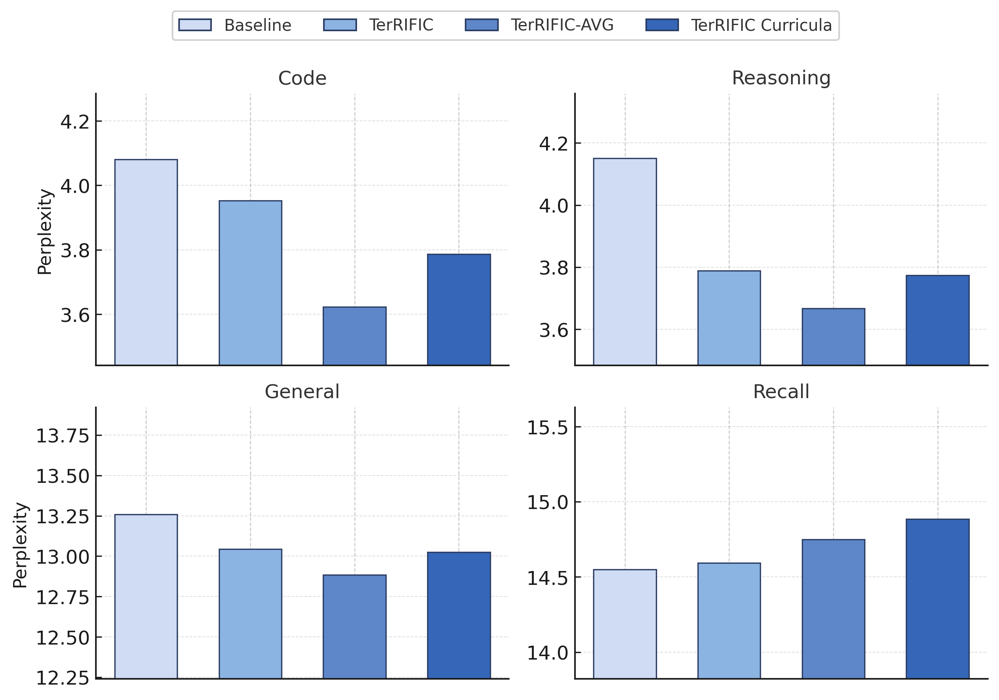
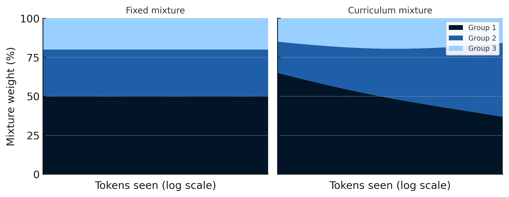
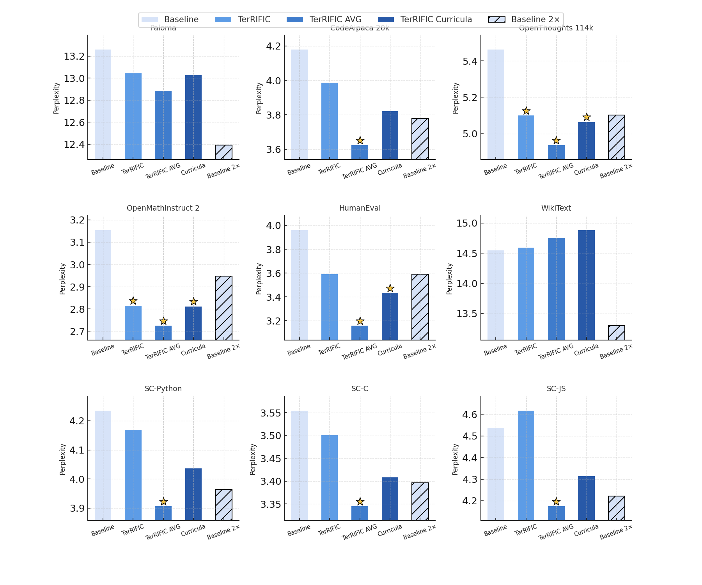
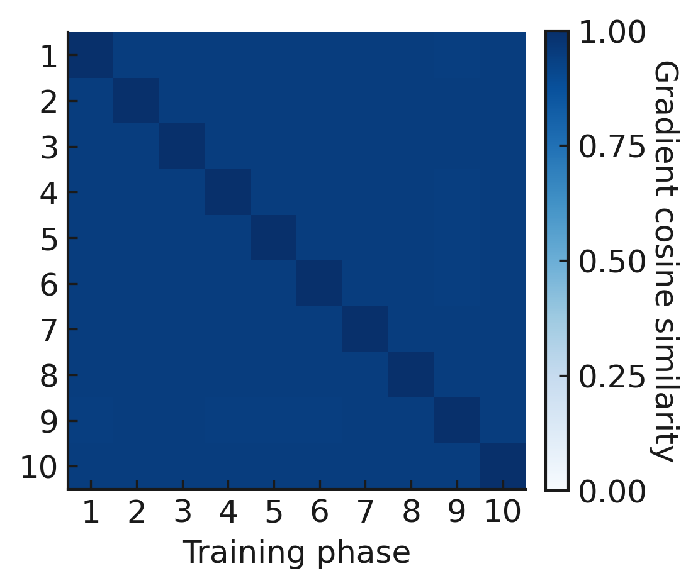
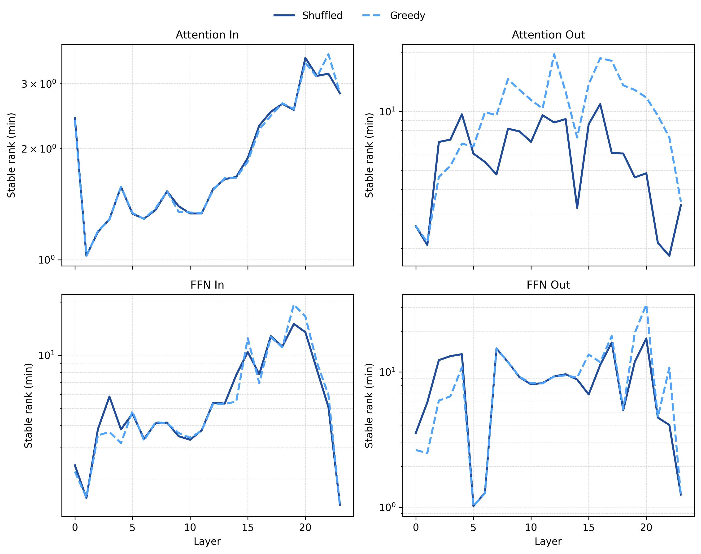
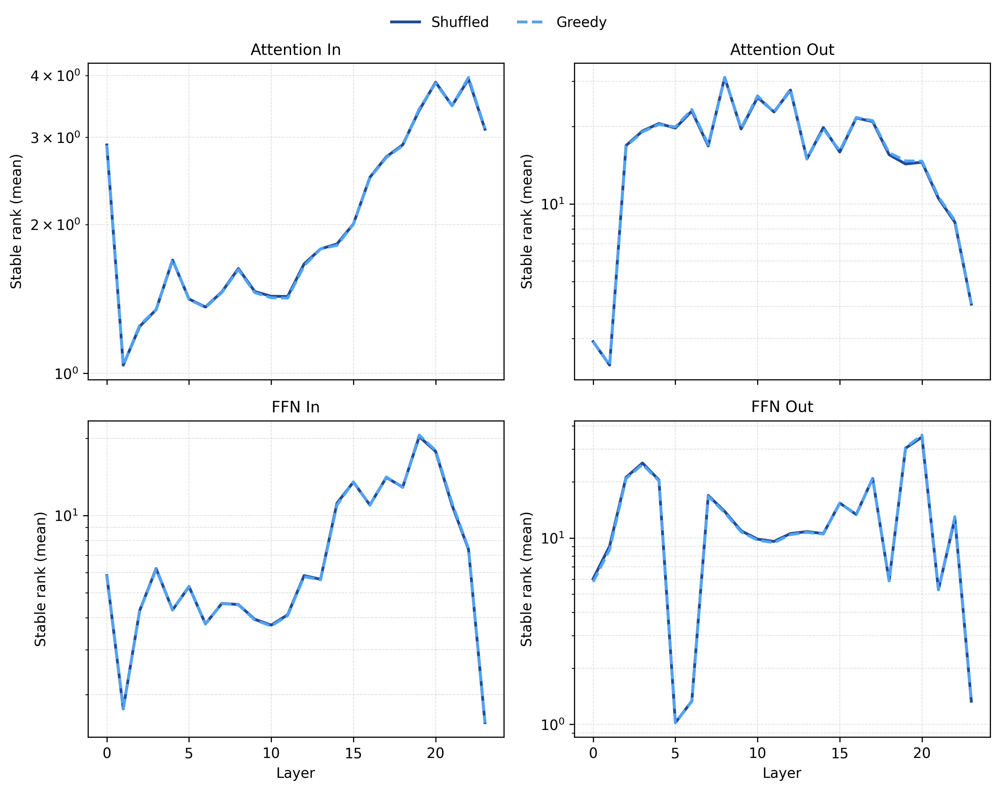

<em>Figure 1: TerRIFIC Curricula consistently outperforms vanilla TerRIFIC, which already sizably beats our strong baseline.</em>

>TL;DR: We meta-learn a continuous curriculum. Our function $f(N,G)$ maps a grouping mechanism to sampling distributions for all values of N, tokens seen. We also propose a greedy algorithm for ordering sequnces to adhere to curricula, which has some desirable qualities when compared to simple shuffling. Our method yields consistent gains, especially on code, math, and reasoning, and often matches or beats models trained with 2× more compute, while staying simple, scalable, and agnostic to how groups are defined.

In this work we introduce **TerRIFIC Curricula**, a scalable, principled way to discover how to optimally sample from a training data distribution *throughout* the course of training. Our method can, non-invasively, participate in any, or all, portions of training. It asks practitioners only to define the set of things they want the model to learn. With this information, it iteratively learns how to modify the data distribution over the course of training to be maximally useful for learning.

## Curriculum Learning

Modern large-scale training pipelines already implement a curriculum (Bengio et al., 2009), even if we do not usually name it as such. Training is no longer a single homogeneous phase: models are pre-trained, then optionally mid-trained, finetuned (SFT), and finally optimized with RL-based methods such as RLHF (Ouyang et al., 2022), RLAIF (Bai et al., 2022), or RLVR (Wen et al., 2025). Each phase uses a different sampling distribution over data and objectives.

Seen this way, the pipeline is a hand-designed, piecewise curriculum over scale. Early on, we show the model a wide slice of the world and ask it to model generic structure. Later, we skew the mixture toward data that looks more like our downstream workload, then toward data with explicit human labels or preference signals, and finally toward reward-optimized interactions. What changes from phase to phase is not the architecture, but what we choose to show the model and how often.

Capabilities are strongly scale-dependent, which creates an asymmetry. Early in training we have abundant data and freedom to explore many ways of presenting it, but only weak local signals about what will matter later. At the end of training we have strong, task-relevant feedback, but much less flexibility to change the trajectory that got us there.

In this work, we view curriculum as the mechanism that ought to tie these regimes together: late-stage signals should inform how we allocate abundant early-stage data, so that the model spends its capacity learning features that are actually useful downstream.

## Discovering Optimal Curricula

We now turn from hand-designed curricula to the question of how to learn one. Concretely, given grouped pre-training data and downstream target(s), we want a procedure that suggests how to weight clusters as a function of training progress.

<em>Figure 2: Visualization of how data mixtures may adapt over training.</em>

We build this in two stages. First, at any fixed training scale, we assume access to a static mixture-learning primitive—our TerRIFIC optimizer—that proposes an update to per-cluster sampling logits. Second, we lift this primitive to a scale-dependent setting, learning a continuous function of training progress whose induced mixtures define a continuous curriculum.

### Warmup: Metagradient Descent + The TerRIFIC Optimizer

In the static setting we maintain a single mixture over clusters that is fixed across the entire training run, conceptually similar to metagradient descent approaches (Engstrom et al., 2025). The goal is to adjust that mixture so that training on it most improves performance on a downstream target set. To accomplish this, we need a good way to measure the impact that training on one example has on another.

A natural conceptual starting point is **influence functions** (Koh et al., 2017). Given optimal parameters $\theta^\star$ for some training objective and a loss $L(z,\theta)$ on example $z$, the influence of a training example $z$ on a target example $z_{\text{test}}$ is defined as

$$
I(z, z_{\text{test}})
= -\nabla_{\theta} L(z_{\text{test}}, \theta^\star)^{\top}
H_{\theta^\star}^{-1}
\nabla_{\theta} L(z, \theta^\star),
$$

where $H_{\theta^\star}$ is the Hessian of the empirical risk at $\theta^\star$. Intuitively, $I(z, z_{\text{test}})$ measures how much up-weighting $z$ would change the loss on $z_{\text{test}}$ under an infinitesimal perturbation.

For modern models, explicitly forming or inverting $H_{\theta^\star}$ is infeasible. Prior work on TerRIFIC provides a stable approximation. Given model parameters $\theta$ and loss $L(z,\theta)$ on example $z$, it constructs

$$
mG_{\theta}(z)
= R^{-1/2}\,P_d\,\mathrm{clip}_{t}\!\bigl(\nabla_{\theta} L(z,\theta)\bigr),
$$

where $\mathrm{clip}_{t}$ applies gradient clipping, $P_d$ projects into a lower-dimensional subspace, and $R^{-1/2}$ whitens with respect to an empirical curvature via gradient-covariance. Alignment in this space acts as a proxy for influence: examples whose $mG_{\theta}(z)$ align well with a target direction are expected to help that target.

Given a target set $\mathcal V$ and clusters ${c_j}_{j=1}^C$, TerRIFIC averages these representations:

$$
\bar v = \frac{1}{|\mathcal V|} \sum_{z\in\mathcal V} mG_{\theta}(z),
\qquad
\bar g_j = \frac{1}{|c_j|} \sum_{z\in c_j} mG_{\theta}(z).
$$

Clusters are then scored by alignment with the target:

$$
\bar I_j = \langle \bar g_j, \bar v \rangle.
$$

These scores define an update direction on the sampling logits. Let $\ell \in \mathbb{R}^C$ be the current logit vector over clusters, and let $\Delta \ell \in \mathbb{R}^C$ denote the increment vector produced by a single TerRIFIC step at the current checkpoint. We run the procedure once and treat the resulting $\Delta \ell$ as a **local meta-gradient** for the logits.

In practice, the raw scores $(\bar I_j)$ are normalized and stabilized before being applied:

* a running mean over clusters is subtracted so that updates are relative;
* variance normalization and clipping are applied across clusters to reduce sensitivity to noise.

The static TerRIFIC optimizer therefore alternates:

1. **Train.** Run the base training loop under the current mixture, up to a checkpoint.
2. **Measure.** Compute $mG_{\theta}(z)$ on held-out target and cluster samples, form $\bar v$, $\bar g_j$, and scores $\bar I_j$.
3. **Update.** Transform $(\bar I_j)$ into a stabilized increment $\Delta \ell$ and update the logits $\ell$.

Repeating this loop until convergence produces a **single static logit vector**: one mixture over clusters used for the entire training range.

In the remainder of this work, we treat this static optimizer as a primitive that, given model parameters $\theta_N$ at some checkpoint corresponding to training progress $N$ and a grouping logic $G$, returns a per-cluster logit update

$$
\Delta \ell(\theta_N, G) \in \mathbb{R}^C
$$

indicating how the mixture should change at that checkpoint.

### Learning Scale-Dependent Logits

We now move from a single global mixture to **scale-dependent mixtures** that explicitly depend on training progress. Rather than one fixed logit vector, we want a function

$$
f: (\mathbb{R}_{>0} \times G) \to \mathbb{R}^C
$$

that maps training progress $N$ and grouping logic $G$ to per-cluster logits. Here, $N$ denotes the total number of training tokens processed so far by the base model. For each $N$, the vector $f(N,G)$ defines a mixture over clusters, and the instantaneous sampling distribution is

$$
p(N;G) = \mathrm{softmax}\big(f(N,G)\big).
$$

Conceptually, we would like to learn a **vector field over scale**: at each progress value $N$ and grouping logic $G$, the static TerRIFIC primitive provides a preferred update direction in logit space. We denote this scale-dependent update by

$$
\Delta f(N, G) \in \mathbb{R}^C.
$$

What is missing is a way to stitch these local directions together into a smooth function of $N$.

### TerRIFIC Curricula

We choose to fit our function in **log-tokens** due to the well documented relationship between capabilities and training set size (Hoffman et al., 2022). Let

$$
s = \log N,\qquad
s_{\min} = \log N_{\min},\quad
s_{\max} = \log N_{\max},
$$

where $[N_{\min}, N_{\max}]$ is the range of training progress over which we want to define a curriculum. We will sample uniformly in $s$.

At meta-iteration $t$, we train a model under the induced mixture, $f_t$
$$
p_t(N; G) = \mathrm{softmax}\bigl(f_t(N, G)\bigr),
$$
saving checkpoints ${\theta_{t,N} : N \in [N_{\min}, N_{\max}]}$ along the way. Given the checkpoints from meta-iteration $t$, we estimate a scale-dependent update field as follows:

> **Algorithm 1: TerRIFIC Curricula**
> **Inputs:** log-progress range $[s_{\min}, s_{\max}]$, batch size $B$, step size $\eta_t$.
>
> 1. Sample $B$ log-time locations
    $$
    \{s_t^{(b)}\}_{b=1}^B \stackrel{\text{i.i.d.}}{\sim}\mathrm{Unif}\bigl([s_{\min}, s_{\max}]\bigr)
    $$
    and set $N_t^{(b)} = e^{s_t^{(b)}}$.
 2. For each checkpoint, obtain an instantaneous per-cluster logit update
    $$
    \Delta f_t\bigl(s_t^{(b)}, G\bigr) \in \mathbb{R}^C.
    $$
 3. Sort ${s_t^{(b)}}$. For any $s \in [s_t^{(i)}, s_t^{(i+1)}]$, define a piecewise-linear interpolant
    $$
    \alpha = \frac{s - s_t^{(i)}}{s_t^{(i+1)} - s_t^{(i)}}, \qquad
    \Delta f_t(s, G) = (1-\alpha),\Delta f_t\bigl(s_t^{(i)}, G\bigr) + \alpha,\Delta f_t\bigl(s_t^{(i+1)}, G\bigr).
    $$
    and clamp to the nearest endpoint value for $s < s_t^{(1)}$ or $s > s_t^{(B)}$.
 4. We finally update the curriculum logits additively. Writing $s = \log N$, the meta-update is
    $$
    f_{t+1}(N, G) = f_t(N, G) + \eta_t ,\Delta f_t\bigl(\log N, G\bigr),
    $$
    with a small step size $\eta_t$.

We repeat this process for $t$ steps, iteratively refining our curriculum.

> A happy side effect of using a continuous curriculum: we no longer need to break pre-training into phases. No resetting optimizer states, decaying learning rate only to warm back up, etc.

### Curriculum-Aligned Scheduling

Once we have a way to decide *what* to sample—whether via simple mixture weights or a learned schedule, we still have to realize it with a finite dataset. Shuffling approximates the desired mixture only in expectation, and cannot adapt to dynamic mixtures. Here we instead *construct an explicit ordering* whose prefixes track the target mixture (and later, a curriculum) as closely as possible.

#### A Greedy Algorithm for Mixture-Adherent Ordering

Consider sequences ${s_1, \dots, s_M}$. Each sequence $s$ is a training chunk that may contain tokens from multiple underlying documents. We associate to each sequence a characteristic vector

$$
\mathbf{c}_s = (c_{s,1}, \dots, c_{s,K}),
$$

where $c_{s,j}$ is the number of tokens in $s$ assigned to group $j$, and each token belongs to exactly one group. Let

$$
\ell_s = \sum_{j=1}^K c_{s,j}
$$

denote the length (in tokens) of sequence $s$.

For a **fixed data mixture** over groups, we specify baseline token proportions

$$
\tau_j \in [0,1],\qquad \sum_{j=1}^K \tau_j = 1,
$$

interpreting $\tau_j$ as “the long-run fraction of tokens that should come from group $j$.”

Let $T_j$ denote the cumulative number of tokens from group $j$ in the prefix we have already selected, and let $S_{\text{tot}}$ be the total number of tokens in that prefix. If we append a new sequence $s$, the updated prefix has

$$
T_j' = T_j + c_{s,j},\qquad S_{\text{tot}}' = S_{\text{tot}} + \ell_s,
$$

and the fixed mixture implies an “ideal” cumulative count

$$
T_j^{\star}(S_{\text{tot}}') = \tau_j S_{\text{tot}}'.
$$

A natural greedy rule is therefore:

* **At each step, choose the next sequence** $s$ that keeps the updated cumulative counts $(T_j')*j$ as close as possible to the mixture-implied targets $(T_j^{\star}(S*{\text{tot}}'))_j$.

This leads to the basic group-matching objective

$$
f_{\text{groups}}(s)
= \sum_{j=1}^{K}
\Bigl[(T_j + c_{s,j}) - \tau_j \bigl(S_{\text{tot}} + \ell_s\bigr)\Bigr]^2.
$$

Greedily minimizing $f_{\text{groups}}(s)$ constructs an ordering whose prefixes stay very near the fixed mixture $T_j^{\star}(S) = \tau_j S$.

However, there is a subtle pitfall. All $\mathbf{c}_s$ share the same $\ell_1$ norm (they sum to the sequence length $\ell_s$), so $f_{\text{groups}}$ implicitly prefers sequences with *less sparse* group membership (smaller $\lVert \mathbf{c}_s \rVert_2$) early in the ordering, and then is forced to consume extremely sparse sequences (e.g., almost all tokens from a single cluster or even a single document) near the end to repair the cumulative error. In typical corpora this looks like: **short, mixed-group slices early; very long, single-source spans late.**

To fix this, we treat **document length** as a first-class part of the target mixture.

##### Doc-Size Regularization via a Length Histogram

We introduce a second characteristic: a quantile-binned histogram over *document* lengths. Sequences are training chunks, but each token remembers which underlying document it came from and that document’s length.

For each sequence $s$, let $\ell_{s,b}$ be the number of tokens in $s$ that come from documents whose length falls in bin $b$ (for $b = 1,\dots,B$). Let

$$
S_{\text{global}} = \sum_{m=1}^M \ell_{s_m}
$$

be the total number of tokens across all sequences. We define the *global* target token share for length bin $b$ as

$$
\kappa_b = \frac{\sum_{m=1}^M \ell_{s_m,b}}{S_{\text{global}}},
$$

i.e., the fraction of all tokens that come from documents in bin $b$ if we traverse the dataset in arbitrary order.

Let $U_b$ track the cumulative number of tokens from bin $b$ in the current prefix. After appending $s$, we would have

$$
U_b' = U_b + \ell_{s,b},
\qquad
S_{\text{tot}}' = S_{\text{tot}} + \ell_s,
$$

and the length-aware mixture implies an “ideal” cumulative count

$$
U_b^{\star}(S_{\text{tot}}') = \kappa_b S_{\text{tot}}'.
$$

We then define a **multi-characteristic objective** that jointly matches both:

* token-level *group* proportions, and
* token-level *doc-length* contributions.

For a fixed data mixture over groups, the ideal cumulative group counts are

$$
T_j^{\star}(S_{\text{tot}}') = \tau_j S_{\text{tot}}'.
$$

In the deterministic case, we score a candidate sequence $s$ by

$$
\boxed{
J_{\text{sched}}(s)
=
\underbrace{
\sum_{j=1}^{K}
\Bigl[(T_j + c_{s,j}) - \tau_j \bigl(S_{\text{tot}} + \ell_s\bigr)\Bigr]^2
}_{\text{group mixture adherence}}
+
\lambda
\underbrace{
\sum_{b=1}^{B}
\Bigl[(U_b + \ell_{s,b}) - \kappa_b \bigl(S_{\text{tot}} + \ell_s\bigr)\Bigr]^2
}_{\text{document-length mixture adherence}}
}
$$

At each step we pick

$$
s^\star = \arg\min_s J_{\text{sched}}(s),
$$

then update

$$
T_j \leftarrow T_j + c_{s^\star,j},\quad
U_b \leftarrow U_b + \ell_{s^\star,b},\quad
S_{\text{tot}} \leftarrow S_{\text{tot}} + \ell_{s^\star},
$$

and repeat.

This greedy scheduler constructs an explicit ordering whose prefixes stay close to a **fixed data mixture** over both groups and document-length bins.

##### Injecting Noise

We also introduce a **single noise hyperparameter** $\sigma_{\text{sched}}$. At each selection step, we add an i.i.d. Gaussian perturbation $\varepsilon_s \sim \mathcal N(0, \sigma_{\text{sched}}^2)$ to the score $J_{\text{sched}}(s)$ for every remaining sequence and pick the minimizer of $J_{\text{sched}}(s) + \varepsilon_s$. When $\sigma_{\text{sched}} = 0$ this reduces to the deterministic greedy schedule; as $\sigma_{\text{sched}}$ grows, the noise dominates differences in $J_{\text{sched}}$ and the induced ordering approaches a random shuffle. In all experiments in this work we set $\sigma_{\text{sched}} = 0$, so all reported results use the deterministic greedy scheduler.

> We include our noised objective to introduce an additional knob to control implicit regularization. We like to think of this parameter as allowing one to "interpolate the amount of S in SGD".

#### Dynamic Schedules: From Fixed Mixtures to Continuous Curricula

So far we have treated $(\tau_j)_j$ as *fixed* mixture weights. Our meta-learning procedure instead produces **scale-dependent logits** $f(N,G)$, and hence time-varying mixture weights—i.e., a *curriculum*.

Recall that for a learned schedule we have

$$
p_j(N) = [\mathrm{softmax}(f(N,G))]_j,
$$

the instantaneous token-level probability of sampling group $j$ at training progress $N$. This defines a cumulative target for each group:

$$
E_j(S) = \int_0^S p_j(n)\,\mathrm{d}n,\qquad \sum_j E_j(S) = S,
$$

which is the ideal number of tokens from group $j$ we would like to have seen by the time we have processed $S$ tokens. As $N$ varies, these $p_j(N)$ implement a continuous curriculum over groups.

To adapt the greedy scheduler, we replace the fixed targets $\tau_j (S_{\text{tot}} + \ell_s)$ with the curriculum-induced cumulative targets

$$
E_j(S_{\text{tot}} + \ell_s),
$$

where $\ell_s$ is the length (in tokens) of candidate sequence $s$.

Because document-length profiles are typically group-dependent, we similarly define a **length-aware curriculum**

$$
U_b^{\star}(S) = \sum_j E_j(S)\,\kappa_{b\mid j},
$$

where $\kappa_{b\mid j}$ is the per-group length-bin share, pre-computed once from the data. Intuitively, $U_b^{\star}(S)$ is the cumulative number of tokens from bin $b$ we would like to have seen by the time we reach $S$ tokens under this curriculum.

In the dynamic case, the multi-characteristic objective is obtained by substituting

* $\tau_j(S_{\text{tot}} + \ell_s) \rightsquigarrow E_j(S_{\text{tot}} + \ell_s)$ in the group term, and
* $\kappa_b(S_{\text{tot}} + \ell_s) \rightsquigarrow U_b^{\star}(S_{\text{tot}} + \ell_s)$ in the length term.

The result is a **curriculum-aligned schedule**: a concrete ordering of sequences whose prefixes closely track the *continuous curriculum* implied by $f(N,G)$.

## Experimental Setup

Our experiments build on the Datacomp for Language Models (DCLM) (Li et al., 2024) recipe. We start from a ~37B-token slice of DCLM-Baseline and reserve ~12B tokens for **learning mixtures and curricula**; the remaining tokens are used for the final training runs under each schedule.

> DCLM-Baseline is already a highly filtered web corpus. The question in this work is not “can we rescue a bad dataset,” but “how much extra signal can we squeeze out of a good one.”

For clustering and targets, we reuse essentially the same pipeline as in the original TerRIFIC work (Melkonian, 2025). Each document is truncated to 1024 tokens and embedded with Qwen3-Embedding-0.6B (Zhang et al., 2025). We then run FAISS k-means (Johnson et al., 2021) with 10,000 clusters, following SemDeDup (Abbas et al., 2023). This gives us a reasonably fine-grained partition of the corpus without exploding meta-compute.

For the target set $\mathcal V$, we again use OpenHermes 2.5 (Teknium, 2024), truncating each example to 2048 tokens. All influence-style quantities, both in the static and scale-dependent settings, are computed against this fixed target set. Intuitively, the “what we care about” part of the setup is exactly the same as before.

All final training runs traverse the corpus using the **same greedy scheduler implementation**. The scheduler takes in a (possibly time-varying) mixture over groups plus doc-length profiles and produces a single-pass ordering whose prefixes track those targets as closely as possible. Once this ordering is fixed, training is just “read the stream once”; there is no per-step curriculum logic during the run.

We learn our curriculum by iteratively training 411M parameter models, before testing our schedules at 1.4B scale.

On top of this shared backbone, we compare four configurations:

1. **Baseline.** The strong DCLM baseline mixture with our greedy scheduler.
2. **TerRIFIC.** A static mixture learned from a single 6.4B-token checkpoint.
3. **TerRIFIC-AVG.** A static mixture learned by averaging influence information from 400M, 800M, 1.6B, 3.2B, and 6.4B-token checkpoints.
4. **TerRIFIC Curriculum.** Our learnable continuous curriculum that lets the mixture depend on training scale, using the same set of checkpoints (400M, 800M, 1.6B, 3.2B, 6.4B).

Across these four settings, the corpus, training budget, model, optimizer, and scheduler are identical. Only the mixture over clusters—static vs. scale-dependent—changes. To keep meta-compute modest, each TerRIFIC call uses a fixed subsample of cluster and target examples to approximate mean cluster influence, as in the original work.

## Results

We evaluate our curriculum by measuring perplexity on a number of held out tasks. These tasks range from information similar to our target set like coding (CodeAlpaca-20k (Chaudhary, 2023), OpenAI Human Eval (Chen et al., 2021), StarCoder (Li et al., 2023)) and math/reasoning (OpenThoughts-114k (Guha et al., 2025) and OpenMathInstruct 2 (Toshniwal et al., 2024)), as well as general language modeling (Paloma (Magnusson et al., 2023)) and recall (Wikitext (Merity et al., 2016)).

<em>Figure 3: We present our core results on 1.4B parameter langauge models trained for 28B tokens.</em>

We find the our curriculum largely outperforms both our strong baseline dataset and vanilla TerRIFIC. These gains are more notable on code, math, and reasoning where we often see it outperforming models trained twice as long.

We do see regression on Wikitext, but note that this is reasonable and may even be desireable. We are trying to learn the most generally useful features. This goal can be at odds with memorization, which is critical for recall. Instead, we pursue a cognitive core: a "model that maximally sacrifices encyclopedic knowledge for capability" (Karpathy, 2025).

### 411M Scale

We find that, unlike at transfer scale 1.4B, at the scale we fit the mixtures, 411M parameter models, TerRIFIC-AVG is often the best performing approach, as seen in Figure 4. This is reasonable as it provides the most stable updates: averaging 5 distinct sub-updates is far lower noise than interpolating between them or using a single checkpoint.

<em>Figure 4: Results at the 411M parameter scale tell a different story when compared to 1.4B. AVG performs best, likely due to the stability of updates.</em>

These results are encouraging when considering the possible scaling axes for variants of TerRIFIC. They show that update stability is critical and can be captured by sampling more points along the training trajectory. This understanding can inform alternative ways to define the curriculum update field in future work.

### Downstream Evaluation

In addition to perplexity based evaluations, we compare performance on a subset of 18 tasks from DCLM-Core. We choose to omit AGI_EVAL_LSAT_AR, Commonsense_QA, BoolQ, and BB-CS-Algorithms due to their noise at this scale following prior work (Melkonian, 2025).

<table style="border-collapse:collapse; width:100%"> <thead> <tr> <th rowspan="2" style="text-align:left">Task</th> <th colspan="3" style="text-align:center">1.4B Model - 28B Tokens</th> <th rowspan="2" style="text-align:right; border-left:2px solid #ccc">2× Baseline</th> </tr> <tr> <th style="text-align:right">Baseline</th> <th style="text-align:right">TerRIFIC</th> <th style="text-align:right">Curricula</th> </tr> </thead> <tbody> <!-- BODY INSERT --> <tr><td>Jeopardy</td><td style="text-align:right">0.244</td><td style="text-align:right">0.247</td><td style="text-align:right"><u>0.255</u></td><td style="text-align:right; border-left:2px solid #ccc">0.321</td></tr> <tr><td>BB-QA-Wikidata</td><td style="text-align:right">0.582</td><td style="text-align:right">0.586</td><td style="text-align:right"><u>0.592</u></td><td style="text-align:right; border-left:2px solid #ccc">0.610</td></tr> <tr><td>ARC-Easy</td><td style="text-align:right">0.536</td><td style="text-align:right">0.544</td><td style="text-align:right"><u>0.556</u></td><td style="text-align:right; border-left:2px solid #ccc">0.561</td></tr> <tr><td>ARC-Challenge</td><td style="text-align:right"><u>0.162</u></td><td style="text-align:right"><u>0.162</u></td><td style="text-align:right">0.142</td><td style="text-align:right; border-left:2px solid #ccc">0.164</td></tr> <tr><td>HellaSwag (0-shot)</td><td style="text-align:right">0.438</td><td style="text-align:right">0.447</td><td style="text-align:right"><u>0.454</u></td><td style="text-align:right; border-left:2px solid #ccc">0.495</td></tr> <tr><td>LAMBADA</td><td style="text-align:right"><u>0.597</u></td><td style="text-align:right">0.587</td><td style="text-align:right">0.586</td><td style="text-align:right; border-left:2px solid #ccc">0.637</td></tr> <tr><td>HellaSwag (10-shot)</td><td style="text-align:right">0.443</td><td style="text-align:right">0.453</td><td style="text-align:right"><u>0.461</u></td><td style="text-align:right; border-left:2px solid #ccc">0.503</td></tr> <tr><td>Winograd</td><td style="text-align:right"><u>0.553</u></td><td style="text-align:right">0.502</td><td style="text-align:right">0.531</td><td style="text-align:right; border-left:2px solid #ccc">0.619</td></tr> <tr><td>Winogrande</td><td style="text-align:right"><u>0.190</u></td><td style="text-align:right">0.163</td><td style="text-align:right">0.174</td><td style="text-align:right; border-left:2px solid #ccc">0.231</td></tr> <tr><td>BB-Language-ID</td><td style="text-align:right">0.179</td><td style="text-align:right">0.182</td><td style="text-align:right"><u><strong>0.185</strong></u></td><td style="text-align:right; border-left:2px solid #ccc">0.174</td></tr> <tr><td>COPA</td><td style="text-align:right"><u>0.460</u></td><td style="text-align:right"><u>0.460</u></td><td style="text-align:right">0.380</td><td style="text-align:right; border-left:2px solid #ccc">0.460</td></tr> <tr><td>PIQA</td><td style="text-align:right">0.489</td><td style="text-align:right">0.502</td><td style="text-align:right"><u>0.514</u></td><td style="text-align:right; border-left:2px solid #ccc">0.529</td></tr> <tr><td>OpenBook-QA</td><td style="text-align:right"><u>0.176</u></td><td style="text-align:right">0.173</td><td style="text-align:right">0.163</td><td style="text-align:right; border-left:2px solid #ccc">0.187</td></tr> <tr><td>BB-Dyck-Languages</td><td style="text-align:right">0.136</td><td style="text-align:right"><u><strong>0.313</strong></u></td><td style="text-align:right">0.191</td><td style="text-align:right; border-left:2px solid #ccc">0.205</td></tr> <tr><td>BB-Operators</td><td style="text-align:right">0.214</td><td style="text-align:right"><u><strong>0.224</strong></u></td><td style="text-align:right">0.210</td><td style="text-align:right; border-left:2px solid #ccc">0.190</td></tr> <tr><td>BB-Repeat-Copy-Logic</td><td style="text-align:right">0.000</td><td style="text-align:right"><u>0.031</u></td><td style="text-align:right"><u>0.031</u></td><td style="text-align:right; border-left:2px solid #ccc">0.125</td></tr> <tr><td>SQuAD</td><td style="text-align:right">0.378</td><td style="text-align:right"><u>0.383</u></td><td style="text-align:right">0.369</td><td style="text-align:right; border-left:2px solid #ccc">0.434</td></tr> <tr><td>CoQA</td><td style="text-align:right"><u>0.308</u></td><td style="text-align:right">0.293</td><td style="text-align:right">0.304</td><td style="text-align:right; border-left:2px solid #ccc">0.336</td></tr> <tr style="border-top: 3px solid currentColor;"><td><strong>Mean</strong></td><td style="text-align:right">0.338</td><td style="text-align:right"><u>0.347</u></td><td style="text-align:right">0.339</td><td style="text-align:right; border-left:2px solid #ccc">0.377</td></tr> </tbody> </table> 
<em>Table 1: Downstream performance (centered accuracy) on the 18-core evals. Underlined = best among Baseline / TerRIFIC / Curricula; underlined + bold = also better than 2× Baseline.</em>

We find that the downstream performance of the Curriculum lags slightly behind vanilla TerRIFIC, while still outperforming the baseline. However, we take these results with caution due to the variance that is present at this scale.

<table style="border-collapse:collapse; width:100%"> <thead> <tr> <th rowspan="2" style="text-align:left">Task</th> <th colspan="3" style="text-align:center">1.4B Model - 28B Tokens</th> <th rowspan="2" style="text-align:right; border-left:2px solid #ccc">2× Baseline</th> </tr> <tr> <th style="text-align:right">Baseline</th> <th style="text-align:right">TerRIFIC</th> <th style="text-align:right">Curricula</th> </tr> </thead> <tbody> <tr><td>Jeopardy</td><td style="text-align:right">1.560</td><td style="text-align:right">1.578</td><td style="text-align:right"><u>1.537</u></td><td style="text-align:right; border-left:2px solid #ccc">1.432</td></tr> <tr><td>BB-QA-Wikidata</td><td style="text-align:right">3.868</td><td style="text-align:right">3.560</td><td style="text-align:right"><u><strong>3.308</strong></u></td><td style="text-align:right; border-left:2px solid #ccc">3.787</td></tr> <tr><td>ARC-Easy</td><td style="text-align:right">2.195</td><td style="text-align:right"><u>2.098</u></td><td style="text-align:right">2.130</td><td style="text-align:right; border-left:2px solid #ccc">2.069</td></tr> <tr><td>ARC-Challenge</td><td style="text-align:right">2.396</td><td style="text-align:right">2.320</td><td style="text-align:right"><u>2.319</u></td><td style="text-align:right; border-left:2px solid #ccc">2.280</td></tr> <tr><td>HellaSwag</td><td style="text-align:right">2.327</td><td style="text-align:right">2.311</td><td style="text-align:right"><u>2.309</u></td><td style="text-align:right; border-left:2px solid #ccc">2.266</td></tr> <tr><td>LAMBADA</td><td style="text-align:right"><u>1.277</u></td><td style="text-align:right">1.326</td><td style="text-align:right">1.317</td><td style="text-align:right; border-left:2px solid #ccc">1.166</td></tr> <tr><td>Winograd</td><td style="text-align:right"><u>2.405</u></td><td style="text-align:right">2.457</td><td style="text-align:right">2.406</td><td style="text-align:right; border-left:2px solid #ccc">2.375</td></tr> <tr><td>Winogrande</td><td style="text-align:right"><u>3.016</u></td><td style="text-align:right">3.022</td><td style="text-align:right">3.030</td><td style="text-align:right; border-left:2px solid #ccc">2.985</td></tr> <tr><td>BB-Language-ID</td><td style="text-align:right">1.518</td><td style="text-align:right">1.575</td><td style="text-align:right"><u><strong>1.483</strong></u></td><td style="text-align:right; border-left:2px solid #ccc">1.716</td></tr> <tr><td>COPA</td><td style="text-align:right">2.446</td><td style="text-align:right"><u>2.415</u></td><td style="text-align:right">2.448</td><td style="text-align:right; border-left:2px solid #ccc">2.386</td></tr> <tr><td>PIQA</td><td style="text-align:right">2.508</td><td style="text-align:right">2.453</td><td style="text-align:right"><u>2.446</u></td><td style="text-align:right; border-left:2px solid #ccc">2.444</td></tr> <tr><td>OpenBook-QA</td><td style="text-align:right"><u>3.998</u></td><td style="text-align:right">4.020</td><td style="text-align:right">4.021</td><td style="text-align:right; border-left:2px solid #ccc">3.950</td></tr> <tr><td>BB-Dyck-Languages</td><td style="text-align:right">4.700</td><td style="text-align:right"><u><strong>3.399</strong></u></td><td style="text-align:right">3.709</td><td style="text-align:right; border-left:2px solid #ccc">4.147</td></tr> <tr><td>BB-Operators</td><td style="text-align:right">4.935</td><td style="text-align:right"><u><strong>4.446</strong></u></td><td style="text-align:right">4.449</td><td style="text-align:right; border-left:2px solid #ccc">4.670</td></tr> <tr><td>BB-Repeat-Copy-Logic</td><td style="text-align:right">1.262</td><td style="text-align:right"><u>1.260</u></td><td style="text-align:right">1.321</td><td style="text-align:right; border-left:2px solid #ccc">1.233</td></tr> <tr><td>SQuAD</td><td style="text-align:right">1.746</td><td style="text-align:right"><u>1.721</u></td><td style="text-align:right">1.800</td><td style="text-align:right; border-left:2px solid #ccc">1.581</td></tr> <tr><td>CoQA</td><td style="text-align:right">1.437</td><td style="text-align:right"><u>1.425</u></td><td style="text-align:right">1.440</td><td style="text-align:right; border-left:2px solid #ccc">1.300</td></tr> <tr style="border-top: 3px solid currentColor;"><td><strong>Mean</strong></td><td style="text-align:right">2.564</td><td style="text-align:right"><u><strong>2.435</strong></u></td><td style="text-align:right">2.440</td><td style="text-align:right; border-left:2px solid #ccc">2.458</td></tr> </tbody> </table> 
<em>Table 1: Correct-answer loss on the same 18-core evals. Lower is better. Underlined = best among Baseline / TerRIFIC / Curricula; underlined + bold = also better than 2× Baseline.</em>

While static TerRIFIC outperforms the curriculum on correct answer perplexities as well, we find that **both** of them outperform the baseline mixture trained **twice as long**. While we still take these results with caution due to the scale, we place slightly more weight on them given the added stability perpleixty provides over accuracy.

## The Merits of Our Scheduler

All training runs in our main curriculum comparison rely on some flavor of the greedy scheduler. To substantiate this choice, we examine its behavior compared to vanilla shuffling.

As we are wary of the many interconnected knobs that can be tuned for better optimization (and since we are now toying with something pretty central), we will not attempt to substantiate our choice by claiming better downstream performance. We do not have the compute to perform sufficient ablations at the required scales.

Instead, we will try to isolate the mechanistic change our method produces. To do so, we will analyze gradients wrt our datasets at a frozen model checkpoint (trained on non-overlapping data).

### Mixture Fidelity (Non-Bias Check)

Shuffling carries nice guarantees, one core example being that we do not bias the data ordering in any. It is a non-starter if our ordering introduces bias. We choose to measure this concretely by looking at large batch gradients of different portions of the corpus. The cosine similarities of different portions of the schedule must not drift.

<em>Figure 5: Cosine similarity of gradients from our ordered corpus split into 10 chunks.</em>

We find that this condition is overwhelmingly satisfied. In fact, chunk cosine similarities all lie in the incredibly tight range of 0.945 and 0.947.

### Updates Provide Diverse Information

With mixture fidelity established, we turn to the effect of ordering on the **geometry of updates**.

For a fixed layer, we collect gradient matrix $M \in \mathbb{R}^{T \times d}$ and compute the stable rank:

$$
\mathrm{srank}(M) = \frac{\lVert M \rVert_F^2}{\lVert M \rVert_2^2},
$$

where $\lVert \cdot \rVert_F$ is the Frobenius norm and $\lVert \cdot \rVert_2$ is the spectral norm. Intuitively, stable rank measures how many “effective directions” are being explored in parameter space.

<em>Figure 6: Minimum stable rank of batch gradients for different layers.</em>

We analyze both worse case (minimum) stable rank, as well as mean stable rank. As we can see in Figures 6 and 7, our ordering is comparable to shuffling on average and often has notably better worse batch performance. This is particularly important as it minimizes the likelihood of a batch batch (or series of batches) damaging the health of our training run.

<em>Figure 7: Mean stable rank of batch gradients for different layers.</em>

## Future Work

This work retains all of the suboptimalities presented in the original TerRIFIC blog. Obvious improvements include: 

- optimization of the target set
- ablation of the influence primitive hyperperparameters
- modifying the grouping mechanism
- better utilizing repeated examples
- meta-learning hyper-parameter optimization.

Additionally, this work opens new directions to explore, namely:

- how does performance change as a function of sampled checkpoints
- is log-tokens the right axis, is log-compute better?
- is the scheduler competitive (better?) than shuffling downstream?
- analysis of the role of the noise parameter in the scheduler
- can we extrapolate the updates beyond the endpoints instead of clamping?

Long story short: **there is still A LOT of low hanging fruit.**

## References

[1] Yoshua Bengio, Jérôme Louradour, Ronan Collobert, Jason Weston. Curriculum Learning. Proceedings of the 26th International Conference on Machine Learning (ICML) (2009).

[2] Jordan Hoffmann, Sebastian Borgeaud, Arthur Mensch, Elena Buchatskaya, Trevor Cai, Eliza Rutherford, Diego de Las Casas, Lisa Anne Hendricks, Johannes Welbl, Aidan Clark, Tom Hennigan, Eric Noland, Katie Millican, George van den Driessche, Bogdan Damoc, Aurelia Guy, Simon Osindero, Karen Simonyan, Erich Elsen, Jack W. Rae, Oriol Vinyals, Laurent Sifre. Training Compute-Optimal Large Language Models. Proceedings of the 36th Conference on Neural Information Processing Systems (NeurIPS) (2022).

[3] Long Ouyang, Jeff Wu, Xu Jiang, Diogo Almeida, Carroll L. Wainwright, Pamela Mishkin, Chong Zhang, Sandhini Agarwal, Katarina Slama, Alex Ray, John Schulman, Jacob Hilton, Fraser Kelton, Luke E. Miller, Maddie Simens, Amanda Askell, Peter Welinder, Paul Christiano, Jan Leike, Ryan J. Lowe. Training Language Models to Follow Instructions with Human Feedback. Proceedings of the 36th Conference on Neural Information Processing Systems (NeurIPS) (2022).

[4] Yuntao Bai, Saurav Kadavath, Sandipan Kundu, Amanda Askell, Jackson Kernion, Andy Jones, Anna Chen, Anna Goldie, Azalia Mirhoseini, Cameron McKinnon, Carol Chen, Catherine Olsson, Christopher Olah, Danny Hernandez, Dawn Drain, Deep Ganguli, Dustin Li, Eli Tran-Johnson, Ethan Perez, Jamie Kerr, Jared Mueller, Jeffrey Ladish, Joshua Landau, Kamal Ndousse, Kamile Lukosuite, Liane Lovitt, Michael Sellitto, Nelson Elhage, Nicholas Schiefer, Noemi Mercado, Nova DasSarma, Robert Lasenby, Robin Larson, Sam Ringer, Scott Johnston, Shauna Kravec, Sheer El Showk, Stanislav Fort, Tamera Lanham, Timothy Telleen-Lawton, Tom Conerly, Tom Henighan, Tristan Hume, Samuel R. Bowman, Zac Hatfield-Dodds, Ben Mann, Dario Amodei, Nicholas Joseph, Sam McCandlish, Tom Brown, Jared Kaplan. Constitutional AI: Harmlessness from AI Feedback. arXiv preprint arXiv:2212.08073 (2022).

[5] Xumeng Wen, Zihan Liu, Shun Zheng, Zhijian Xu, Shengyu Ye, Zhirong Wu, Xiao Liang, Yang Wang, Junjie Li, Ziming Miao, Jiang Bian, Mao Yang. Reinforcement Learning with Verifiable Rewards Implicitly Incentivizes Correct Reasoning in Base LLMs. arXiv preprint arXiv:2506.14245 (2025).

[6] Pang Wei Koh, Percy Liang. Understanding Black-box Predictions via Influence Functions. Proceedings of the 34th International Conference on Machine Learning (ICML) (2017).

[14] Logan Engstrom, Andrew Ilyas, Benjamin Chen, Axel Feldmann, William Moses, Aleksander Madry. Optimizing ML Training with Metagradient Descent. arXiv preprint arXiv:2503.13751 (2025). 
arXiv

[15] Jeffrey Li, Alex Fang, Georgios Smyrnis, Maor Ivgi, Matt Jordan, Samir Gadre, Joanna Materzynska, Tiger Zhang, Benjamin Eysenbach, Yi Su, Shivanshu Purohit, Utsav Prabhu, Prudhvi Raj Dachapally, Maria Jose Benitez, Gabriel Ilharco, Mitchell Wortsman, Ellery Wulczyn, Wei-Hung Weng, Christopher Ré, Keenan Jones, Sidharth Mudgal, Glen Wiley, Rob McMenemy, Jason Phang, Gabriella Harari, Tingyuan Liang, Diana Acosta-Navas, Kirthevasan Kandasamy, Chiyuan Zhang, Kenji Hata, G. Andrew Dullerud, Yiding Jiang, Fatemehsadat Mireshghallah, Samir Yitzhak Gadre, Andreas Veit, Benjamin L. Edelman, Pranav Rajpurkar, Sayna Ebrahimi, Ludwig Schmidt. DataComp-LM: In Search of the Next Generation of Training Sets for Language Models. arXiv preprint arXiv:2406.11794 (2024).

[16] Amro Abbas, Kushal Tirumala, Dániel Simig, Surya Ganguli, Ari S. Morcos. SemDeDup: Data-efficient Learning at Web-scale through Semantic Deduplication. arXiv preprint arXiv:2303.09540 (2023).

[22] Yanzhao Zhang, Mingxin Li, Dingkun Long, Xin Zhang, Huan Lin, Baosong Yang, Pengjun Xie, An Yang, Dayiheng Liu, Junyang Lin, Fei Huang, Jingren Zhou. Qwen3 Embedding: Advancing Text Embedding and Reranking Through Foundation Models. arXiv preprint arXiv:2506.05176 (2025). 
arXiv

[25] Raymond Li, Loubna Ben Allal, Yangtian Zi, Niklas Muennighoff, Denis Kocetkov, Chenghao Mou, Marc Marone, Christopher Akiki, Jia Li, Jenny Chim, Qian Liu, Evgenii Zheltonozhskii, Terry Yue Zhuo, Thomas Wang, Olivier Dehaene, Mishig Davaadorj, Joel Lamy-Poirier, João Monteiro, Oleh Shliazhko, Nicolas Gontier, Nicholas Meade, Armel Zebaze, Ming-Ho Yee, Logesh Kumar Umapathi, Jian Zhu, Benjamin Lipkin, Muhtasham Oblokulov, Zhiruo Wang, Rudra Murthy, Jason Stillerman, Siva Sankalp Patel, Dmitry Abulkhanov, Marco Zocca, Manan Dey, Zhihan Zhang, Nour Fahmy, Urvashi Bhattacharyya, Wenhao Yu, Swayam Singh, Sasha Luccioni, Paulo Villegas, Maxim Kunakov, Fedor Zhdanov, Manuel Romero, Tony Lee, Nadav Timor, Jennifer Ding, Claire Schlesinger, Hailey Schoelkopf, Jan Ebert, Tri Dao, Mayank Mishra, Alex Gu, Jennifer Robinson, Carolyn Jane Anderson, Brendan Dolan-Gavitt, Danish Contractor, Siva Reddy, Daniel Fried, Dzmitry Bahdanau, Yacine Jernite, Carlos Muñoz Ferrandis, Sean Hughes, Thomas Wolf, Arjun Guha, Leandro von Werra, Harm de Vries. StarCoder: May the Source Be with You! Transactions on Machine Learning Research (TMLR); arXiv preprint arXiv:2305.06161 (2023).

[26] Etash Guha, Ryan Marten, Sedrick Keh, Negin Raoof, Georgios Smyrnis, Hritik Bansal, Marianna Nezhurina, Jean Mercat, Trung Vu, Zayne Sprague, Ashima Suvarna, Benjamin Feuer, Liangyu Chen, Zaid Khan, Eric Frankel, Sachin Grover, Caroline Choi, Niklas Muennighoff, Shiye Su, Wanjia Zhao, John Yang, Shreyas Pimpalgaonkar, Kartik Sharma, Charlie Cheng-Jie Ji, Yichuan Deng, Sarah Pratt, Vivek Ramanujan, Jon Saad-Falcon, Jeffrey Li, Achal Dave, Alon Albalak, Kushal Arora, Blake Wulfe, Chinmay Hegde, Greg Durrett, Sewoong Oh, Mohit Bansal, Saadia Gabriel, Aditya Grover, Kai-Wei Chang, Vaishaal Shankar, Aaron Gokaslan, Mike A. Merrill, Tatsunori Hashimoto, Yejin Choi, Jenia Jitsev, Reinhard Heckel, Maheswaran Sathiamoorthy, Alexandros G. Dimakis, Ludwig Schmidt. OpenThoughts: Data Recipes for Reasoning Models. arXiv preprint arXiv:2506.04178 (2025).

[27] Teknium. OpenHermes 2.5: An Open Dataset of Synthetic Data for Generalist LLM Assistants. arXiv preprint arXiv:2404.00495 (2024).

[28] Ian Magnusson, Akshita Bhagia, Paloma Team. Paloma: A Benchmark for Evaluating Language Model Fit. arXiv preprint arXiv:2312.10523 (2023). 
arXiv

[29] Sahil Chaudhary. Code Alpaca: An Instruction-following LLaMA Model for Code Generation. GitHub repository, https://github.com/sahil280114/codealpaca
 (2023).

[30] Shubham Toshniwal, Wei Du, Ivan Moshkov, Branislav Kisacanin, Alexan Ayrapetyan, Igor Gitman. OpenMathInstruct-2: Accelerating AI for Math with Massive Open-Source Instruction Data. arXiv preprint arXiv:2410.01560 (2024). 
alphaXiv

[31] Mark Chen, Jerry Tworek, Heewoo Jun, Qiming Yuan, Henrique Ponde de Oliveira Pinto, Jared Kaplan, Harri Edwards, Yuri Burda, Nicholas Joseph, Greg Brockman, Alex Ray, Raul Puri, Gretchen Krueger, Michael Petrov, Heidy Khlaaf, Girish Sastry, Pamela Mishkin, Brooke Chan, Scott Gray, Nick Ryder, Mikhail Pavlov, Alethea Power, Lukasz Kaiser, Mohammad Bavarian, Clemens Winter, Philippe Tillet, Felipe Petroski Such, Dave Cummings, Matthias Plappert, Fotios Chantzis, Elizabeth Barnes, Ariel Herbert-Voss, Will Guss, Alex Nichol, Igor Babuschkin, Suchir Balaji, Shantanu Jain, Andrew N. Carr, Jan Leike, Josh Achiam, Vedant Misra, Evan Morikawa, Alec Radford, Matthew Knight, Miles Brundage, Mira Murati, Katie Mayer, Peter Welinder, Bob McGrew, Dario Amodei, Sam McCandlish, Ilya Sutskever, Wojciech Zaremba. Evaluating Large Language Models Trained on Code. arXiv preprint arXiv:2107.03374 (2021). 
arXiv

[32] Stephen Merity, Caiming Xiong, James Bradbury, Richard Socher. Pointer Sentinel Mixture Models. arXiv preprint arXiv:1609.07843 (2016).

[34] Jeff Johnson, Matthijs Douze, Hervé Jégou. Billion-scale Similarity Search with GPUs. IEEE Transactions on Big Data 7(3):535–547 (2021); arXiv preprint arXiv:1702.08734 (2017).

[35] Joseph Melkonian. Learning Which Data To Learn: The TerRIFIC Meta-Optimizer. Blog post, joemelko.github.io (2025).

[37] Andrej Karpathy. “The race for LLM ‘cognitive core’ – a few billion param model that maximally sacrifices encyclopedic knowledge for capability.” Tweet, X (2025).