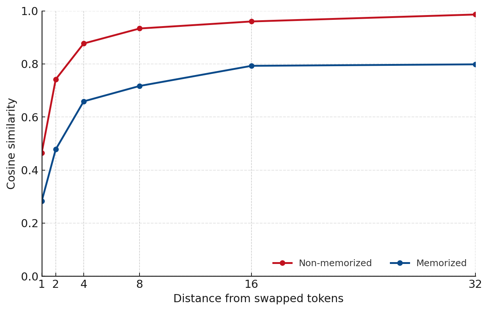

*Figure 1: Cosine similarities between unchanged and flipped token-level gradients based on distance from the swapped tokens.*

Recent work (Prabhudesai et al., 2025) has exposed an interesting characteristic of causal transformers:

*they can be trained longer and to a lower final loss when token ordering is not strictly adhered to.*

This is likely due to the fact that this builds smoother interpolations over discrete tokens. In fact, explicitly making architectural changes to enforce local smoothing of token representations (Allen-Zhu et al., 2025) showed gains doing exactly this. One reasonable interpretation of this is that token-order jittering (or smoothing) allows models to build generalizations over examples instead of memorizing them, even after seeing the same chunk of text many times. This begs the following question: 

*can we detect memorized samples solely by examining their sensitivity to token order changes?*

## Experimental Setup

To analyze the impact of token order changes, we use a very simple setup. We examine OLMo-2-1B (Team OLMo et al., 2025) and some examples from its training dataset, Dolma (Soldaini et al., 2024). More concretely, we use 100 examples that contain memorized text and 100 examples that are randomly sampled from the corpus. These examples use 64 prefix tokens followed by 48 suffix tokens (those that are memorized when applicable).

The method is simple:
1. Pass the original sequence through the model.
2. Swap the final two tokens in the prefix and pass the sequence again.
3. Analyze changes in gradients and activations.

## Results

|| Non-memorized | Memorized |
|-------:| ------------: | --------: |
|Activation Similarity|        **0.9013** |    0.8366 |
|Gradient Similarity (suffix tokens)|        **0.9294** |    0.6875 |

*Table 1: Alignment between original and swapped sequences for activations and gradients after token-order changes. Memorized examples show far less robustness to token order swaps.* 

We find that memorized examples exhibit drastically higher sensitivities to token order changes for both activations and gradients. Additionally, analysis of gradient norms and loss changes shows the drastic impact a single token swap has on memorized examples. While loss remains an order of magnitude lower for the memorized examples, the gradient norm exceeds that of the non-memorized examples.

*Figure 2: Impact of swapping final prefix tokens on loss and gradient norm of suffix tokens for memorized and non-memorized examples.*

It is also interesting to consider how representational differences are impacted by the proximity to the token order swap. If we consider next-token prediction as a combination of memorization and conceptual representation, we would expect the impact of token swapping on non-memorized data to be highly local, while memorized data would suffer consequences over far longer portions of the sequence. 

We find this is exactly the case. In fact, while the token gradients for non-memorized examples rapidly approach their non-corrupted gradient counterparts as we move away from the token swap, whereas the memorized examples plateau at roughly 0.8. It seems that either memorization fundamentally corrupts conceptual representation, or that memorized examples have drastically different conceptual meanings for slightly different token orders. It is highly likely that either can be true for various examples.

## Final Thoughts

Local token-order swaps cleanly separate memorized from non-memorized spans and give a simple, label-free audit. If we want to reduce this brittleness, we expect that the two easiest knobs are: small token-order jitter during training or mild architectural smoothing (e.g., Canon-style).

To substantiate these remedies, one may train small models from scratch with a handful of examples heavily upsampled to probe memorization under three regimes: no mitigation, token‑order jitter, and architectural smoothing. We hope someone pursues this direction.

## References:

[1] M. Prabhudesai, M. Wu, A. Zadeh, K. Fragkiadaki, D. Pathak, Diffusion Beats Autoregressive in Data-Constrained Settings, arXiv:2507.15857 (2025).

[2] Z. Allen-Zhu, Physics of Language Models: Part 4.1, Architecture Design and the Magic of Canon Layers, SSRN: 5240330 (2025).

[3] Team OLMo, P. Walsh, L. Soldaini, D. Groeneveld, K. Lo, N. A. Smith, H. Hajishirzi, et al., 2 OLMo 2 Furious, arXiv:2501.00656 (2025).

[4] L. Soldaini et al., Dolma: an Open Corpus of Three Trillion Tokens for Language Model Pretraining Research, arXiv:2402.00159 (2024).
