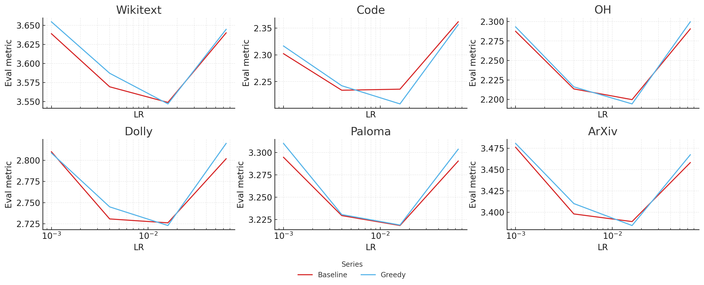

# Don't Shuffle, Optimize: A Recipe For Training Data Diversity

Data diversity is widely studied at various levels of the training process; it is understood to be critical both across the corpus (Deng et al., 2009; Halevy et al., 2009; Gao et al., 2021; Gadre et al., 2023; Zhao et al., 2024; Miranda et al., 2024) and when constructing batches (Yin et al., 2018; Zhao & Zhang, 2014; Pan et al., 2024). This work will focus on a broader definition of the latter:

*Given a corpus of documents, how do we materialize a tokenized dataset that is optimally diverse <u>throughout</u> training?*

Our core claim: **you can do better than shuffling.**

## Initial Observation

While working on the TerRIFIC meta-optimizer (Melkonian, 2025), we implemented a shuffling strategy that required sequences to be drawn from distinct clusters of documents. Due to this, we were required to tokenize clusters of documents separately. The result of this setup:

- optimal (coarse) cluster-level diversity throughout training
- high within-sequence document relatedness
- minimal within-sequence diversity

Naturally, we can devise various alternative methods for materializing a tokenized dataset that yield different tradeoffs. This begs the question:

*What is the best may to materialize a tokenized dataset from a corpus of documents?*

## Goal

When transforming a set of training examples into a tokenized dataset, we intend to ensure that the characteristics of the data we train on are constant throughout training. More formally:

Consider a corpus where each example possesses various characteristics: *any* measurable or identifiable traits such as topic, domain, style, quality, source, language, complexity, etc.. When materializing this into a tokenized dataset $\mathcal{T}$, we want every training window to maintain the same distribution of characteristics as the global corpus. 

Let $\rho_j(\mathcal{T}_{[a:b]})$ be the proportion of characteristic $j$ in window $[a:b]$, and $\rho_j(\mathcal{T})$ its global proportion. We optimize the following uniform distribution objective:

$$\max_{j} \max_{[a:b]} \left| \rho_j(\mathcal{T}_{[a:b]}) - \rho_j(\mathcal{T}) \right|$$

In other words: **ensure no characteristic becomes over (under) represented in any part of training.**

> Our goal assumes we are not intending to set a curriculum. Even in cases of discrete curricula (pre -> mid -> post training), each portion of training typically operates without specific ordering.

### Shuffling

The overwhelming majority of work attempts to adhere to our objective via rigorous shuffling. This asks the question:

*how well does this achieve our uniform distribution objective?*

If we could shuffle individual tokens perfectly, the expected deviation would be roughly $\sqrt{2p_j(1-p_j)/(\pi n)}$ for characteristic $j$ with proportion $p_j$ in windows of size $n$—reasonably good for large training windows. However, shuffling operates at the document (and/or sequence) level, not individual tokens. This results in far larger deviations than these ideal bounds suggest.

**We should be able to do a bit better.**

### A Greedy Algorithm For Optimal Data Diversity

Instead of shuffling, we can directly construct an ordering that optimizes our diversity objective.

The algorithm is straightforward. For sequences $\{s_1, \dots, s_M\}$ of length $L$, each with characteristic vector $\mathbf{c}_s = (c_{s,1}, \dots, c_{s,K})$. We instantiate characteristics as group membership: $c_{s,j}$ is the count of tokens in sequence $s$ belonging to group $j$, with each token belonging to exactly one group, so $\sum_{j=1}^K c_{s,j} = L$.

1. **Compute target proportions:** $\tau_j = \frac{\sum_{m=1}^{M} c_{s_m,j}}{ML}$ for each characteristic $j$

2. **Greedily select sequences** that minimize deviations from target proportions using objective function $f(s)$

3. **Update running totals** after each selection

*But what objective should we use?*

#### Approach 1: Pure Characteristic Balancing

The simplest approach—minimize squared deviations from target proportions:
$$f_1(s) = \sum_{j=1}^{K}\Bigl[\,(T_j + c_{s,j}) \;-\; \tau_j\,\bigl(S_{\text{tot}} + L\bigr)\Bigr]^2$$

There is a critical flaw with this approach: **sequences with uniform group distributions will be preferred over sequences with concentrated group distributions.** In practice, this will result in shorter documents appearing early in training and longer documents concentrated toward the end.

Since all characteristic vectors have the same L1 norm ($L$), the issue is L2 norm differences: sequences with evenly distributed tokens across groups have smaller $\|\mathbf{c}_s\|_2$ than sequences concentrated in few groups.

#### Approach 2: L2 Norm Regularization

To mitigate this, we add a penalty for deviating from expected cumulative L2 norms:
$$f_2(s) = f_1(s) + \lambda \cdot \left(N + \|\mathbf{c}_s\|_2 - \frac{S_{\text{tot}} + L}{L} \cdot \bar{N}\right)^2$$

where $N$ tracks the current sum of characteristic vector L2 norms and $\bar{N} = \frac{1}{M}\sum_{m=1}^M \|\mathbf{c}_{s_m}\|_2$ is the average L2 norm. After selecting $s^\star$: $N \leftarrow N + \|\mathbf{c}_{s^\star}\|_2$.

This improves upon pure characteristic balancing, but creates a different problem: the algorithm greedily selects sequences near the average L2 norm early on, then oscillates between unusually concentrated and unusually uniform sequences later to correct the cumulative deviation.

#### Approach 3: Multi-Characteristic Balancing (Clusters + Document Length)

 We add a second characteristic—document length—using a quantile histogram over document lengths:
$$f_3(s) = \sum_{j=1}^{K}\Bigl[(T_j + c_{s,j}) - \tau_j\,(S_{\text{tot}} + L)\Bigr]^2 + \lambda \cdot \sum_{b=1}^{B}\Bigl[(U_b + \ell_{s,b}) - \kappa_b\,(S_{\text{tot}} + L)\Bigr]^2$$

where $\ell_{s,b}$ is the number of tokens in $s$ drawn from documents whose length falls in bin $b$ (with $b=1,\dots,B$), $\kappa_b = \frac{\sum_{m=1}^{M} \ell_{s_m,b}}{ML}$ is the global target token share for bin $b$, $U_b$ tracks cumulative tokens from bin $b$, $S_{\text{tot}}$ is the cumulative token count, and $\lambda$ controls the relative strength of the length objective.

After selecting $s^\star$: $T_j \leftarrow T_j + c_{s^\star,j}$, $U_b \leftarrow U_b + \ell_{s^\star,b}$, and $S_{\text{tot}} \leftarrow S_{\text{tot}} + L$.

**The result: balanced cluster proportions and document-length contributions throughout training.**

## Experimental Setup

We train 162m and 411m parameter models for 2.6B and 8.2B tokens respectively using the training harness from Datacomp for Language Models (Li et al., 2024). Models are trained on the DCLM-Baseline corpus.

To gather the information necessary to order sequences, we embed the first 1024 tokens of each document using Qwen3-Embedding-0.6B (Zhang et al., 2025) and use FAISS k-means to cluster the documents in $1,000$ clusters. We use $100$ bins to construct the document length histograms.

## Results

### Training Dynamics

Due to computational constrains, we are limited in our ability to produce statistically significant results at scale. As a result, we start with a concrete analysis of the schedule produced by our greedy algorithm.

#### Adherence To Our Uniform Distribution Objective

As we describe above, we attempt to minimize the euclidian distance between expected tokens and actual tokens from each clusters and expected and actual tokens from each document size bucket. While our algorithm is greedy, and thus we expect some degradation when minimal samples remain, ideally our ordering is strictly better than random shuffling throughout. We track our pair of errors throughout the ordering process in addition to logging per-batch errors.

(side by side chart of 2 errors for greedy and random plot)

Results show that our method produces a strictly better data ordering than random shuffling across both metrics. At all times during training, our algorithm yields cumulative characteristic counts that are closer to our uniformity objective than random sampling.

(plot with batch level stats)

Also, the worst batch produced by our algorithm contains higher characteristic diversity (across both cluster membership and document size) than the best batch produced by random shuffling.

#### Quantifying Batch Diversity

In order to substantiate that our characteristics translate to more diverse model updates, we riggorously analyze the batch gradients produced for each dataset at fixed checkpoints (20% and 100% of steps) for 411m parameter models. 

(chart showing stable ranks)

Figure X shows that our greedy algorithm produces updates that are of substantially higher stable rank for both attention and feed-forward blocks for nearly all layers. This is concrete proof that, given the same underlying dataset, we are able to construct a curricula offline in a way that carries significantly more new information per update.

### Downstream Results

We evaluate performance using downstream loss on Paloma (Magnusson et al., 2023), WikiText (Merity et al., 2016), CodeAlpaca-20k (Chaudhary, 2023), OpenHermes 2.5 (cite) and Arxiv (cite).

<em>Figure 2: Performance of 162M parameter models on our suit of 6 tasks. Results show averge performance across 2 seeds.</em>

Across our eval suite (excl. Wikitext), our method achieves superior performance than baseline shuffling. This is as expected due to measurably superior diversity across batches and throughout training.

However, we also see increased sensitivity to the learning rate. While somewhat surprising, we hypothesize this is due to decreased implicit regularization. Since gradients are higher rank throughout training, training steps are smoother and, possibly less able to exit bad local minima. We were not able to ablate weight decay and other hyperparameters due to compute constraints.

> It is worth noting that it is also entirely possible that something in the greedy algorithm injects sufficient bias to destabilize training; however, we were unable to identify any such issues.

| Task | Baseline | Greedy | Greedy_Block |
| --- | ---: | ---: | ---: |
| Wikitext | 3.136239 | **3.119557** | 3.124753 |
| Code | **1.785277** | 1.785420 | 1.801962 |
| OH | **1.835516** | 1.849768 | 1.846710 |
| Dolly | 2.406693 | **2.400921** | 2.400974 |
| Paloma | **2.890408** | 2.898527 | 2.895843 |

<em>Table 1: NLL across meta‑iterations on our target tasks. Best results are underlined.</em>

When we scaled up to 411m parameter models, we introduced a third configuration, which involved rearranging batches produced by our greedy ordering which we will call greedy_block_shuffle. This was done to attempt to mitigate any potential biases in the greedy algorithm while maintaining high batch diversity.

### Cluster Packed Sequences

We also experiment with intentionally packing sequences with documents from the same cluster. Previous work has show this can often lead to superior downstream performance, but has shown this to be the case when attention is allowed to flow across documents. Instead, we test the scenario where cross-document attention is disallowed. We expect this to produce the worst results since sequences are explicitly created with minimal diversity. 

While we find this is generally true, Figure Y shows this is not always the case. In fact, degradation is highly sensitive to the downstream task. This is particularly interesting since the underlying dataset is unchanged. Perhaps the most surprising result is that performance improves on Wikitext, dispite the general regression in language model capabilites.

#### Task Curvature Explains Diversity Impacts

In order to attempt to explain this phenomenon, we inspect the characteristics of the gradients wrt our downstream tasks. It is well known that knowledge of different tasks are distributed into largely orthogonal sub-networks during training, especially early on (cite, cite, cite --- maybe recent paper). 

## Discussion

Previous work (Shi et al., 2023) discusses the idea of in-context pre-training. The general proposition is that sequences should be comprised of documents that are related. Their work showed that by packing sequeneces in this way, they were able to improve recall capabilties, specifically in long-context settings. Later work (Zhao et al., 2024) performed a similar analysis with similar conclusions.

My intuition for these approaches (when cross-document attention is allowed) is that the context creation is akin to a form of synthetic data generation. Training is no longer designed to treat documents as independent, but instead desires that attention will flow across the related documents that yields better context utilization at test time. It is then reasonable that the show performance gains on tasks that are recall heavy, like wikitext. However, it seems that the effect from pseudo synthetic data is not.

## References

[1] Jia Deng, Wei Dong, Richard Socher, Li-Jia Li, Kai Li, Li Fei-Fei. ImageNet: A Large-Scale Hierarchical Image Database. In Proceedings of the 2009 IEEE Conference on Computer Vision and Pattern Recognition (CVPR) (2009).

[2] Alon Halevy, Peter Norvig, Fernando Pereira. The Unreasonable Effectiveness of Data. IEEE Intelligent Systems (2009).

[3] Leo Gao, Stella Biderman, Sid Black, Laurence Golding, Travis Hoppe, Charles Foster, Jason Phang, Horace He, Anish Thite, Noa Nabeshima, Shawn Presser, Connor Leahy. The Pile: An 800GB Dataset of Diverse Text for Language Modeling. arXiv preprint arXiv:2101.00027 (2021).

[4] Samir Yitzhak Gadre, Gabriel Ilharco, Alex Fang, Jonathan Hayase, Georgios Smyrnis, Thao Nguyen, Ryan Marten, Mitchell Wortsman, Dhruba Ghosh, Jieyu Zhang, Eyal Orgad, Rahim Entezari, Giannis Daras, Sarah Pratt, Vivek Ramanujan, Yonatan Bitton, Kalyani Marathe, Stephen Mussmann, Richard Vencu, Mehdi Cherti, Ranjay Krishna, Pang Wei Koh, Olga Saukh, Alexander Ratner, Shuran Song, Hannaneh Hajishirzi, Ali Farhadi, Romain Beaumont, Sewoong Oh, Alex Dimakis, Jenia Jitsev, Yair Carmon, Vaishaal Shankar, Ludwig Schmidt. DataComp: In search of the next generation of multimodal datasets. arXiv preprint arXiv:2304.14108 (2023).

[5] Dora Zhao, Jerone T. A. Andrews, Orestis Papakyriakopoulos, Alice Xiang. Position: Measure Dataset Diversity, Don’t Just Claim It. In Proceedings of the 41st International Conference on Machine Learning (ICML) (2024).

[6] Brando Miranda, Alycia Lee, Sudharsan Sundar, Allison Casasola, Rylan Schaeffer, Sanmi Koyejo. Beyond Scale: The Diversity Coefficient as a Data Quality Metric for Variability in Natural Language Data. OpenReview (submitted to ICLR 2025) (2024).

[7] Dong Yin, Ashwin Pananjady, Max Lam, Dimitris Papailiopoulos, Kannan Ramchandran, Peter L. Bartlett. Gradient Diversity: a Key Ingredient for Scalable Distributed Learning. In Proceedings of the 21st International Conference on Artificial Intelligence and Statistics (AISTATS) (2018).

[8] Peilin Zhao, Tong Zhang. Accelerating Minibatch Stochastic Gradient Descent using Stratified Sampling. arXiv preprint arXiv:1405.3080 (2014).

[9] Xingyuan Pan, Luyang Huang, Liyan Kang, Zhicheng Liu, Yu Lu, Shanbo Cheng. G-DIG: Towards Gradient-based Diverse and High-quality Instruction Data Selection for Machine Translation. arXiv preprint arXiv:2405.12915 (2024).

[10] Weijia Shi, Sewon Min, Maria Lomeli, Chunting Zhou, Margaret Li, Gergely Szilvasy, Rich James, Xi Victoria Lin, Noah A. Smith, Luke Zettlemoyer, Scott Yih, Mike Lewis. In-Context Pretraining: Language Modeling Beyond Document Boundaries. arXiv preprint arXiv:2310.10638 (2023).

[11] Yu Zhao, Yuanbin Qu, Konrad Staniszewski, Szymon Tworkowski, Wei Liu, Piotr Miłoś, Yuxiang Wu, Pasquale Minervini. Analysing the Impact of Sequence Composition on Language Model Pre-Training. In Proceedings of the 62nd Annual Meeting of the Association for Computational Linguistics (ACL) (2024).

[12] Joseph Melkonian. Learning Which Data To Learn: The TerRIFIC Meta-Optimizer. Blog post (2025). Available at: https://joemelko.github.io/blog.html?post=TopicReweighting.

While the 2-way jittered shuffling allowed for duplicate sequences (and semantically similar information) to be evenly spaced throughout training, it also required that semanically similar data be tokenized together (for perfectly spaced sequences). However, when training a baseline model on data tokenized and interleaved in this manner, instead of increasing performance, it actually dropped.

This is due to the fact that sequences often contain more than 1 document. In fact, most sequenes contain text from 2 or more documents. As a result, the cluster --> jitter approach increases inter-sequence diversity, but decreases intra-sequence diversity (aggressively). If we make the (very relaxed) assumption that within the same cluster, gradients are perfectly identical across data, then our setup ensure that we end up with a maximally diverse set of batch_size clusters contributing to a step, but the default shuffle ends up with a less diverse set of ~2 * batch_size clusters. In practice gradients within a cluster are not perfectly identical, but are similar enough to outweigh the benefit of ideally spacing them in a baseline setting.

However, it is important to consider what happens to their relative importance when the cluster weights are adjusted during the learning process. The farther cluster weights move from initialization, the more inter-cluster diversity is decreased across a random shuffle. Also, the more likely duplicate sequences are to appear in the same or close proximity batches.

#### Possible Resolutions And Their Limitations

Clearly it would be optimal to maintain the cluster spacing. I left the resolution of this issue to future work, but list below some ideas below, concluding with a setup that seems optimal:

1. **Perform the repetition-aware spacing at the document level**  

      Documents vary in length, so work in token-space.

      Let $\ell_d$ be the token count of document $d$, $L_{tot}=\sum_d\ell_d$, and for each cluster  
      $$
        \tau_i=\frac{\sum_{d\in c_i}\ell_d}{L_{tot}}
      $$
      be its target token share.

      After $S_{tot}$ tokens have been scheduled, cluster $i$ has $T_i$ tokens.  
      Choose the next document by
      $$
        d^{\star}= \arg\min_{d}\Bigl|(T_{c(d)}+\ell_d)-\tau_{c(d)}\,(S_{tot}+\ell_d)\Bigr|,
      $$
      keeping every $T_i$ as close as possible to its ideal track $\tau_i S_{tot}$.

2. **Perform the repetition-aware spacing at the sequence lebel**

      Tokenize the shuffled corpus into fixed-length sequences $\{s_1,\dots,s_M\}$. For each sequence $s$ and cluster $i\in\{1,\dots,|C|\}$ let $\ell_{s,i}$ be the number of cluster-$i$ tokens in $s$, and define $\ell_s=\sum_{i=1}^{|C|} \ell_{s,i}$. The target global share of cluster $i$ is
      $$
      \tau_i \;=\; \frac{\sum_{m=1}^{M}\ell_{s_m,i}}{\sum_{m=1}^{M}\ell_{s_m}},
      \qquad \sum_{i=1}^{|C|} \tau_i = 1.
      $$
      Maintain running totals $T_i$ (tokens from cluster $i$ already scheduled) and $S_{tot}=\sum_{i=1}^{|C|} T_i$, and let $\mathcal U$ be the set of unscheduled sequences. At each step, select
      $$
      s^\star \in \arg\min_{\,s\in\mathcal U}\;\sum_{i=1}^{|C|}\Bigl[\,(T_i+\ell_{s,i}) \;-\; \tau_i\,\bigl(S_{tot}+\ell_s\bigr)\Bigr]^2,
      $$
      append $s^\star$ to the schedule, and update
      $$
      T_i \leftarrow T_i+\ell_{s^\star,i},\qquad
      S_{tot} \leftarrow S_{tot}+\ell_{s^\star},\qquad
      \mathcal U \leftarrow \mathcal U\setminus\{s^\star\}.
      $$
      Initialize $T_i\!=\!0$, $S_{tot}\!=\!0$, and repeat until $\mathcal U=\varnothing$.

3. **Idea 2 with duplicate separation**

      One remaining limitation of the approach outlined in 2 is ignorance to exact duplicates. We can simply modify this to split the dataset into $max(duplication_{ratio})$ cluster weight aware subsets. Within each subset we can guarantee documents are unique. Finally, we can perform the procedure outlined in Idea 2 and then concatenate the datasets.